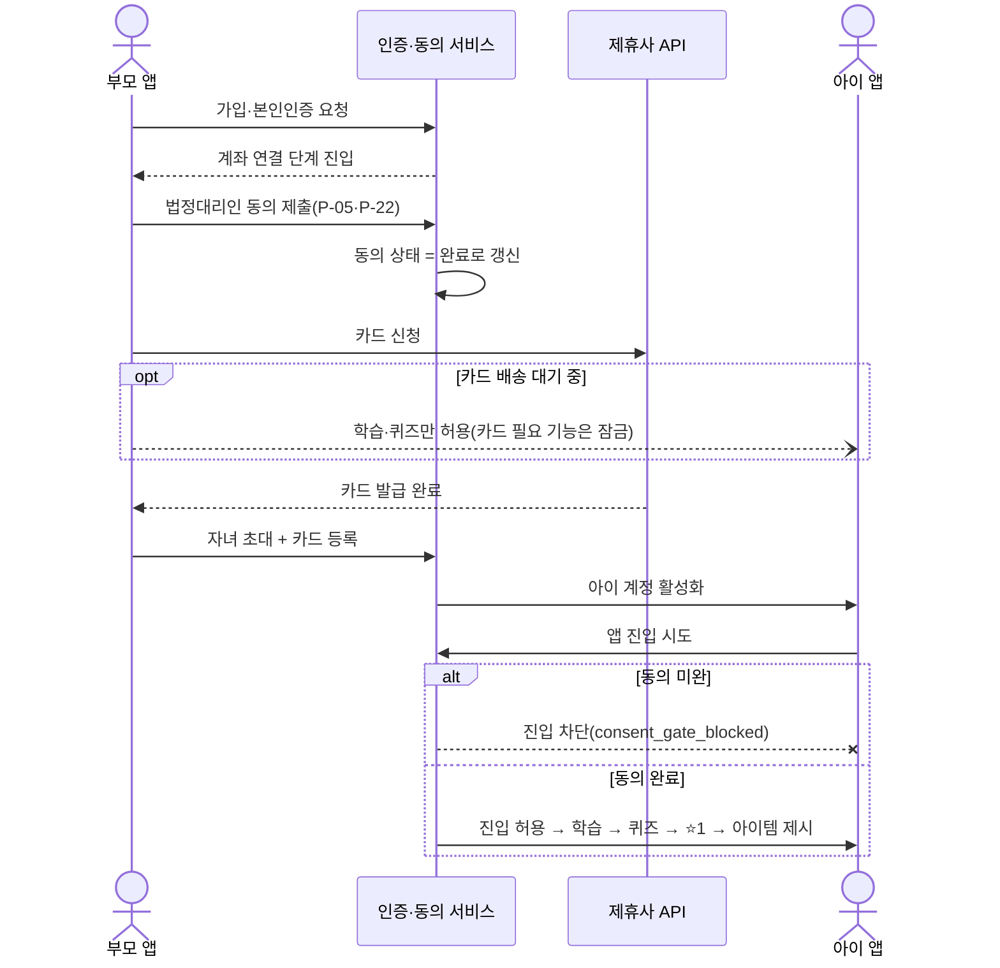
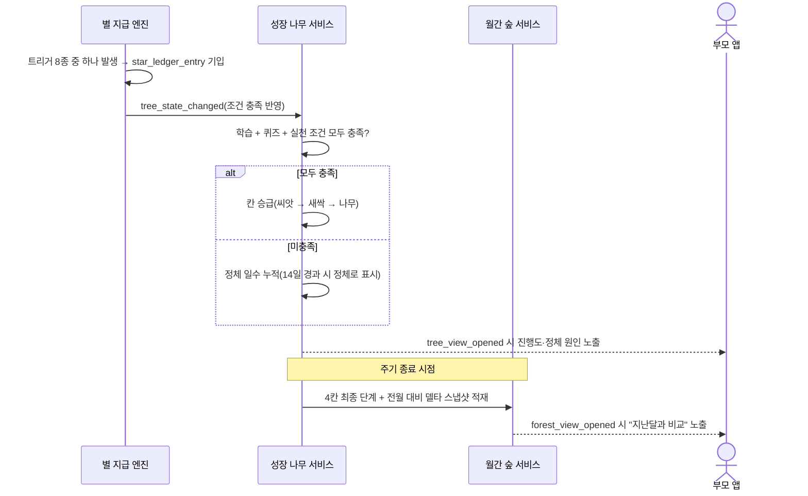
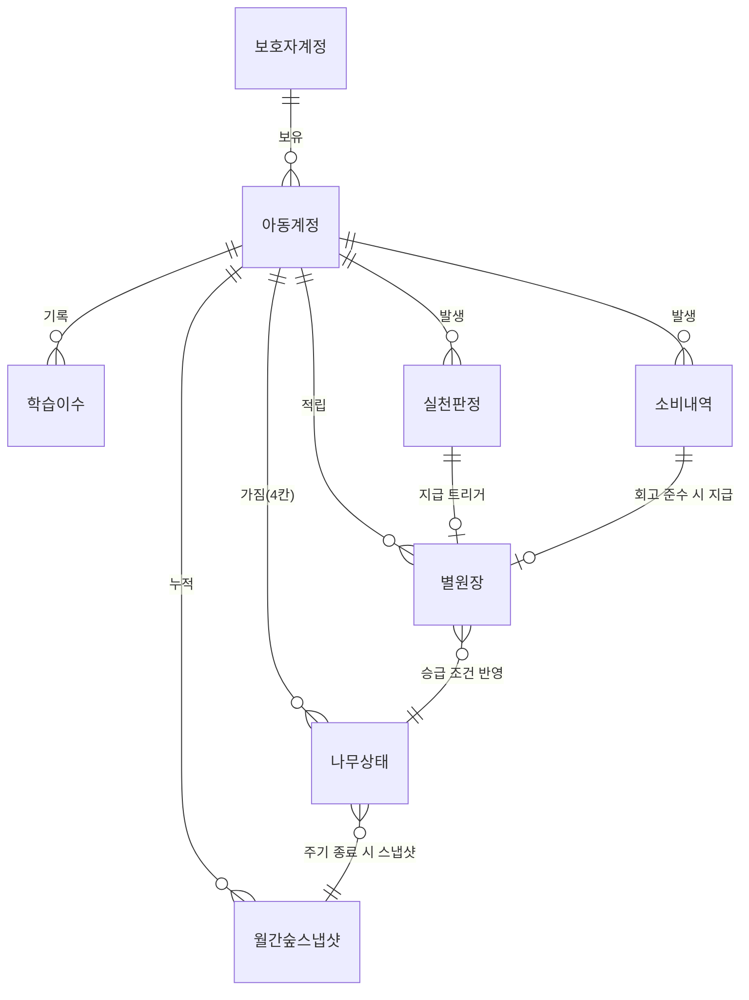
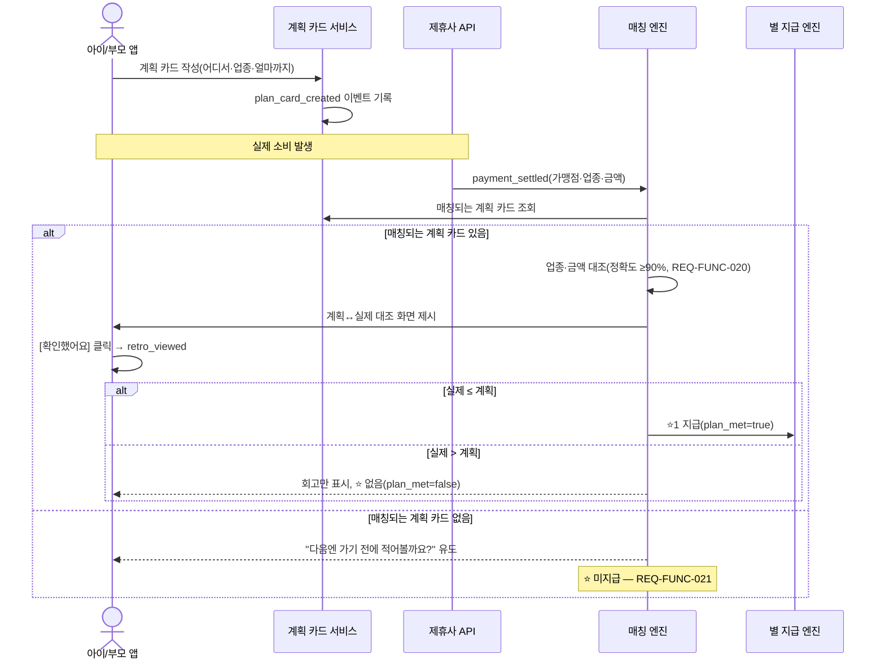
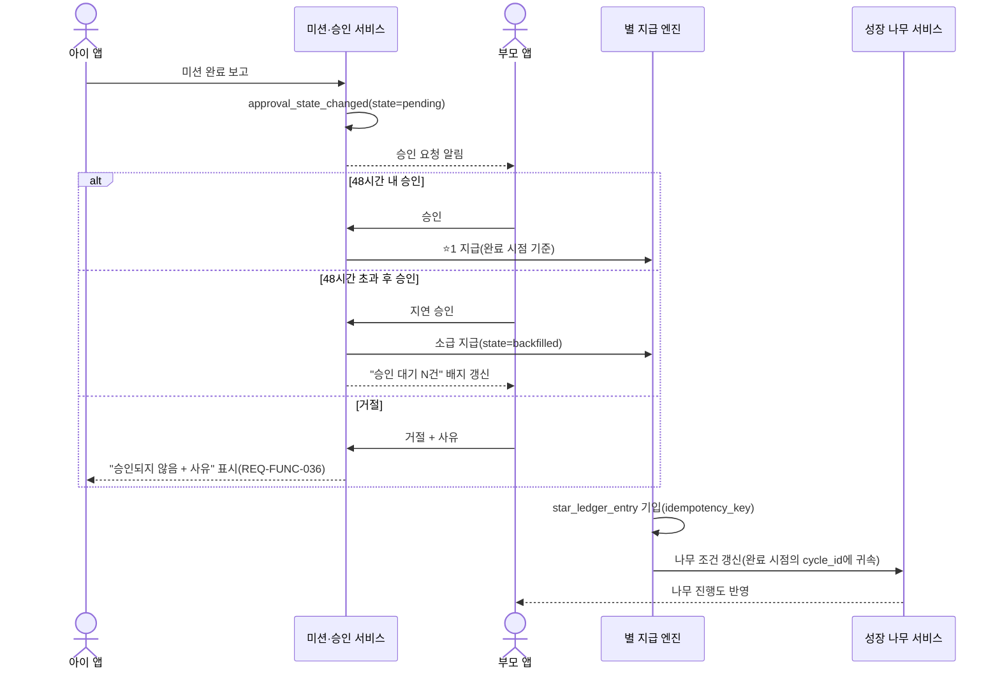

# Software Requirements Specification (SRS)
Document ID: SRS-001
version: 0.2
Date: 2026-08-31
Standard: ISO/IEC/IEEE 29148:2018

> **v0.2 (2026-08-31)** — F11(3일 미접속 알림) 삭제 확정에 따라 REQ-FUNC-039~044·REQ-NF-009·REQ-NF-026과 관련 이벤트(`inactivity_notified`)·엔티티 필드(알림시간대설정)·시퀀스 5·트레이서빌리티 매트릭스 US-7 행을 취소선 처리. ID는 재사용하지 않고 보존(`SRS_핀프렌즈_v1_2.md` §13 v1.3과 동기화).

> **Source of Truth** — `PRD_핀프렌즈_v0_3.md`. 본 문서의 모든 요구사항은 해당 PRD에 이미 기재된 내용에서 도출되었으며, PRD에 없는 요구사항은 신설하지 않았다. PRD의 등급 표기 정책(§9-2, 미검증 수치·페르소나에 대한 인용 금지)을 그대로 승계하며, 목표 수치는 별도 표기가 없는 한 **[가설]** 또는 **⬜ 미측정** 상태다.

---

## 1. Introduction

### 1.1 Purpose

핀프렌즈(FinFriends)는 아동 대상 용돈·금융 학습 앱이다. 본 SRS는 다음 문제(Pain)를 해결하기 위한 소프트웨어 요구사항을 정의한다.

| Pain ID | 문제 | 층위 |
|---|---|:-:|
| C1 | 누적 숫자(일수·문제수·금액)가 성장의 증거가 되지 못한다 | ★ 선별 |
| C2 | 실천 칸이 비어 4개 나무가 전부 정체한다 | ★ 선별 |
| C5 | 소비 직전 자동 개입 수단이 없다 — 계획을 적어둔 소비만 대조 가능 | ★ 선별 |
| C3 | 2주 정체를 부모가 아이의 능력 문제로 해석한다 | ◇ 보조 |
| C6 | 계획을 지킨 날에도 회고를 읽지 않고 누른다 | △ 감시 |

본 SRS의 목적은 위 문제에 대응하는 기능(REQ-FUNC)과, 그 대응이 실제로 작동하는지 판단할 수 있는 정량 기준(REQ-NF)을 ISO/IEC/IEEE 29148:2018에 따라 명세하는 것이다.

### 1.2 Scope

**In-Scope**

| 영역 | 내용 |
|---|---|
| 핵심 흐름 | 벌기 → 잘 쓰기 → 모으기 → 불리기(학습 4주제 + 실천 판정 3경로: 미션·회고·위시리스트) |
| 신뢰 전달 | 성장 나무(F1), 월간 숲(F9), 정체 원인 표시 |
| 사전·사후 소비 관리 | 소비 계획 카드 + 계획↔실제 대조(F8) |
| 보상 체계 | 별 지급 엔진(F4), 아바타·옷장(F5) |
| 온보딩·규제 | 부모 온보딩 + 법정대리인 동의(F7) |
| 끊김 방지 | 승인 지연 시 소급 지급(F10) |

**Scope 정량 기준(KPI → NFR 근거, PRD §1-2/§1-3 승계)**

| Outcome | 목표[가설] | 대응 REQ-NF |
|---|:-:|:-:|
| 7일 내 첫 실천 인정률(O4) | ≥60% | REQ-NF-024 |
| 계획 카드 작성률(O7, F8 생존조건) | ≥50% | REQ-FUNC-022 |
| 정체 원인 열람률(O10) | ≥60% | REQ-FUNC-014 |
| WPA(북극성, β 기준) | ≥5/8 | REQ-NF-023 |

**Out-of-Scope**

| 구분 | 내용 |
|---|---|
| 영구 제외 | 앱 외부 현금(세뱃돈 등) · 친구 기능 · 모의투자 · 미션 사진 인증 |
| 이번 릴리즈 제외 | 위치 알림(F14, 삭제 확정) · 예적금 실천(F15, P-20 선행) · 카드 없는 체험(F16) · 별의 옷장 외 목적지(F17, P-21 선행) · 기록 이전(F18) · 소비 사전 개입 자동 트리거(F19, 삭제 확정 — F8로 흡수) |

### 1.3 Definitions, Acronyms, Abbreviations

| 용어 | 정의 |
|---|---|
| WPA | Weekly Practiced Active — 주간 실천 인정 아동 비율(북극성 KPI) |
| AOS / DOS | Attractive/Dissatisfied Opportunity Score — 고객 체감/시장 가중 기회점수. 합성 가설 위의 분석자 판단값으로, 순위 비교용으로만 사용하며 "검증됨"으로 인용하지 않음(PRD §9-2) |
| 검증과제 ①~⑥ | PRD §5.1(Assumptions)에 정의된, 아직 확인되지 않은 6개 전제(예: 부모의 금융 집중 요구, 제휴사 수수료율) |
| MoSCoW | Must·Should·Could·Won't — 기능 우선순위 4단계 |
| PASS/HOLD/FAIL | 3구간 판정 — 통과 / 보류(표본 추가 후 재판정) / 실패(재설계) |
| AC / AC-E | Acceptance Criteria / Exception Acceptance Criteria |
| ADR | Architecture Decision Record — 설계 결정 기록 |
| cycle_id | 나무 승급 조건이 귀속되는 정산 주기 식별자 |
| idempotency_key | 이벤트 중복 처리를 방지하기 위한 고유 키 |

### 1.4 References

| ID | 문서 |
|---|---|
| REF-01 | `VPS v2.0 rooted` — 자립 리서치 문서(1,089줄), 본 PRD·SRS의 근거 |
| REF-02 | `PRD_핀프렌즈_v0_3.md` — 본 SRS의 직접 원본(Source of Truth) |
| REF-03 | `PRD_핀프렌즈_v0_1_품질리뷰.md` — PRD v0.1→v0.2 결함 리뷰(측정·검증 가능성 결함 11건) |
| REF-04 | ISO/IEC/IEEE 29148:2018(E), *Systems and software engineering — Life cycle processes — Requirements engineering* |
| REF-05 | v13 기능정의서·가치제안서 — F 번호·MVP 컷라인의 원 출처(PRD가 승계) |
| REF-06 | `SRS_핀프렌즈_v1_2.md` — ISO 29148 §8.5.2/§9.6 목차를 기준 포맷으로 사용한 선행 변환본. 본 문서는 동일 PRD를 별도의 고정 템플릿(REQ-FUNC/REQ-NF 원자적 ID + Traceability Matrix)으로 재구성한 것이며 REF-06을 대체하지 않음 |

### 1.5 Constraints

규제 상수는 협상 불가하며 상세는 §4.2(REQ-NF-010~018)에 명세한다. 요약:

| 조항 | 제약 |
|---|---|
| P-05·P-22 | 법정대리인 동의 완료 전 아동 화면 진입 불가 |
| P-19 | 만 14세 미만 위치정보 옵트인 + 좌표 미저장, 서버 지오펜싱 불가 |
| P-01·P-21 | 별은 차감형·교차 금지, 별↔저금통 완전 분리(전환 경로 자체를 코드에 두지 않음) |
| P-13 | 아동 아바타 얼굴 이미지 미수집 |
| P-20 | 예적금 가입 중개 불가(F15 선행 조건) |
| F-01 | 만 14세 미만 마이데이터 가입 불가 → 표준 오픈뱅킹 연동 불가, 자체 카드 발급 폐쇄형 구조 필수 |

주요 설계 결정(왜 이 구조를 택했는가)은 ADR 형식으로 REF-06 §11(ADR-001~006)에 기록되어 있으며, 본 문서는 이를 재작성하지 않고 참조한다.

### 1.6 Assumptions and Risks

**가정(검증과제, PRD 승계)**

| 가정 | 상태 |
|---|:-:|
| 부모가 금융 집중을 원한다 | 🔴 [가설] — 검증과제 ① |
| 부모가 이자를 실제로 지급한다 | 🔴 [가설] — 검증과제 ③ |
| 제휴사 수수료율·최소 물량 조건 | ⬜ 미확인 — 검증과제 ⑥ |
| 나무 성장 단계 수·조건 수치·동물 종수 등 | ⬜ 미결(사양) — 팀 결정 대기 |

**주요 리스크(3건 이상, PRD §7-2 승계)**

| # | 리스크 | 대응 |
|:-:|---|---|
| R1 | C5에 F8이 부분 대응 — 자동 발동 부재. 작성률이 낮으면 사전·사후가 함께 무너짐 | 계획 카드 작성률 MVP 4주 실측(REQ-FUNC-022) |
| R3 | 선언 ①("성장할 수 있습니다")은 실제 성장 효과 증명이 없는 주장 | 대외 문구를 "설계상 그렇게 되도록 만들었다"까지로 제한 |
| R5 | 수익 산출식이 없음(제휴 수수료율 미확인) | REQ-NF-020, 검증과제 ⑥ |
| R8 | 아이 Pain이 부모 화면에 신호로 나타나지 않음(12건 중 0건) | F11(REQ-FUNC-039~044) 삭제로 완화 수단 없음 — 대체 완화책 필요 시 별도 결정 |

---

## 2. Stakeholders

| Role | Responsibility | Interest |
|---|---|---|
| 부모(보호자) — H1 정미경형 | 법정대리인 동의, 계좌·카드 연결, 미션 승인, 나무·숲 확인 | 아이의 금융 행동 변화를 짧은 시간에 확인하고 싶음(C1) |
| 부모(보호자) — H2 배성우형 | 계획 카드 작성(대행 가능), 결제 계획↔실제 대조 확인 | 아이가 쓰기 전에 한 번 멈추고, 그 선택이 기록으로 남길 원함(C5) |
| 아동 사용자 | 학습·퀴즈 수행, 미션 수행, 계획 카드 작성, 소비, 회고 확인 | 실천이 눈에 보이게 반영되어 계속할 이유가 생기길 원함(C2) |
| 제휴사(선불업 등록 보유) | 카드 발행·가맹점망 운영·이용한도 관리·선불충전금 별도관리 | 계약된 수수료 수익, 규제 준수 |
| 제품기획 담당(Owner 팀) | 기능 우선순위(MoSCoW) 결정, 로드맵 관리 | MVP 범위 내 검증 가능한 제품 출시 |
| 정책·법령 담당(Owner 팀) | 규제 상수(P-05~P-22, F-01) 준수 확인 | 법적 리스크 0건 |
| 개발 온콜 | 정합성·규제 이벤트 모니터링 대응(§4.2 모니터링 REQ-NF) | 시스템 신뢰성 유지 |
| 콘텐츠 담당 | 학습 콘텐츠·회고 문장 풀 관리 | 콘텐츠 소진·형식화 방지 |

---

## 3. System Context and Interfaces

### 3.1 External Systems

| 시스템 | 역할 | 근거 |
|---|---|---|
| 제휴사(선불업 등록 보유) | 선불전자지급수단 발행·관리, 선불충전금 별도관리, 카드 발행, 가맹점망, 이용한도·업종 제한(P-17·P-18) | PRD §6-3 |

핀프렌즈는 브랜드·앱·4칸 학습·실천 시스템·성장 나무·월간 숲·별 원장·실천 판정 로직을 소유하며, 제휴사에 카드 발행·가맹점망·이용한도를 의존한다. 만 14세 미만은 마이데이터 가입이 불가능하므로(F-01) 표준 오픈뱅킹 연동을 사용할 수 없고, 이 제약이 폐쇄형 구조 채택의 근거다.

### 3.2 Client Applications

| 클라이언트 | 사용 주체 | 주요 화면 |
|---|---|---|
| 부모 앱 | 보호자 | 온보딩·동의, 성장 나무, 월간 숲, 미션 승인, 계획 카드(대행), 알림 설정 |
| 아이 앱 | 아동 | 학습·퀴즈, 미션 수행, 계획 카드 작성, 소비 계획↔실제 대조, 회고, 아바타·옷장, 위시리스트 |

### 3.3 API Overview

> ⚠️ PRD는 리소스·이벤트 단위의 오퍼레이션만 정의하며 구체적인 REST 경로·프로토콜을 명시하지 않는다. 아래는 **논리 오퍼레이션 수준**의 명세이며, 실제 엔드포인트 설계는 구현 단계에서 결정한다(추측성 경로를 여기서 확정하지 않음).

**외부(제휴사) 연동 오퍼레이션**

| Operation | Input | Output | Constraint |
|---|---|---|---|
| 충전 요청 | 보호자_id, 금액 | 충전 결과, 잔액 | 한도는 제휴사 정책 종속 |
| 결제 내역 조회 | 아동 카드_id, 기간 | 거래 목록(시각·금액·가맹점 분류) | 가맹점 분류 상세도가 회고 품질을 좌우 |
| 해지·환불 | 아동 카드_id | 환불 결과 | 전액 환불(P-11) |

**내부 이벤트 오퍼레이션(아이/부모 앱 ↔ 백엔드)**

| Event | Trigger | 필수 필드 | 소비 주체 |
|---|---|---|---|
| practice_credited | ⭐ 지급 확정 | child_id, trigger_code, earned_at, awarded_at, approval_mode, tree_slot | WPA, O4, O6 산출 |
| star_ledger_entry | 별 증감 확정 | child_id, delta, trigger_code, balance_after, idempotency_key | 정합성 감사(REQ-NF-007) |
| tree_state_changed | 나무 조건 갱신 | child_id, slot, stage_before, stage_after, cond_learn, cond_quiz, cond_practice, stall_days | O5, C3 |
| tree_view_opened | 부모 나무 진입 | parent_id, dwell_ms, evidence_expanded, stall_reason_shown | O10 |
| forest_view_opened | 부모 숲 진입 | parent_id, year_month, delta_items_rendered, dwell_ms | O2, O14 |
| retro_viewed | 회고 화면 이탈 | child_id, sentence_id, dwell_ms, plan_amount, actual_amount, plan_met, star_granted | C6 |
| approval_state_changed | 승인 상태 변경 | mission_id, state, delay_hours, cycle_id | US-6 계열 |
| onboarding_step | 온보딩 단계 전환 | parent_id, step(1~5), state, resumed | US-8 계열 |
| consent_gate_blocked | 동의 미완 진입 차단 | parent_id, attempted_at | 규제 모니터링(REQ-NF-021) |

> 적재 규칙 — 모든 이벤트는 `idempotency_key`, `client_ts`/`server_ts`를 포함해야 한다. 오프라인 발생 이벤트는 `client_ts` 기준으로 주차에 귀속된다.

### 3.4 Interaction Sequences (핵심 시퀀스 다이어그램)

**핵심 시퀀스 1 — 온보딩·동의 게이트**

**핵심 시퀀스 2 — 별 → 나무 → 숲 캐스케이드**

추가적인 상세 시퀀스(계획 카드→매칭→회고, 미션 승인→소급 지급)는 §6.3에서 정의한다.

---

## 4. Specific Requirements

### 4.1 Functional Requirements

> 표기 규칙 — Priority는 해당 기능(F#)의 MoSCoW를 승계한다. Source는 PRD의 User Story·AC 또는 F-table 항목을 가리킨다. "Exception"으로 표시된 항목은 AC-E(예외·실패 케이스)에서 도출되었다.

| ID | Feature | Priority | Requirement | Acceptance Criteria (Given/When/Then) | Source |
|---|:-:|:-:|---|---|---|
| REQ-FUNC-001 | F1 | Must | The system shall enable ≥6/8 parent respondents to recall in one sentence what changed this month after a 5-second exposure of the 성장 나무 screen. | Given ≥1 실천 기록 이번 달 / When 나무 화면 5초 노출 후 덮음 / Then 1문장 회상 성공 ≥6/8 | US-1 AC1 |
| REQ-FUNC-002 | F1 | Must | The system shall make the practice-based basis of tree growth discoverable without facilitator intervention for ≥6/8 respondents. | Given 나무 기본 상태 / When "나무가 자란 이유"를 질문 / Then 개입 0회로 「실천」 도달 ≥6/8 | US-1 AC2 |
| REQ-FUNC-003 | F9 | Must | The system shall let ≥6/8 parents identify ≥3 changed items within 60 seconds in the 월간 숲 screen, with median confirmation time ≤3 minutes. | Given 전월 데이터 존재 / When 월간 숲에서 변화 탐색 / Then 60초 내 3개 이상 지목 ≥6/8, 확인시간 중위 ≤3분 | US-1 AC3 |
| REQ-FUNC-004 | F9 | Must | The system shall render "이번 달 획득 별" without scrolling regardless of current star balance. | Given 별 잔액 0 / When 월간 숲 진입 / Then 스크롤 없이 노출, 누적 성과 지목 ≥6/8 | US-1 AC4 |
| REQ-FUNC-005 | F1 | Must (Exception) | The system shall display an empty-state message ("아직 기록 없어요 + 첫 실천 안내") when zero practice records exist, and ≤2/8 respondents shall misread it as a defect. | Given 이번 달 실천 0건 / When 성장 나무 진입 / Then 안내 표시, 결함 오인 ≤2/8 | US-1 AC-E1 |
| REQ-FUNC-006 | F9 | Must (Exception) | The system shall replace the month-over-month comparison area with "다음 달부터 비교할 수 있어요" when no prior-month data exists, and shall not render a 0% delta. | Given 가입 첫 달 / When 월간 숲 진입 / Then 대체 문구 표시, 델타 0 렌더 금지 | US-1 AC-E2 |
| REQ-FUNC-007 | F2/F4 | Must | The system shall credit a star and update tree progress within the same session upon completion of 1 of 5 practice triggers within 7 days of signup, achieving a ≥60% first-practice recognition rate. | Given 가입 7일 이내 / When 실천 트리거 1종 최초 완료 / Then ⭐지급+나무진행도 동일세션 반영, 인정률 ≥60% | US-2 AC1 |
| REQ-FUNC-008 | F1 | Must | The system shall NOT advance a tree slot's stage when its practice count is zero, and shall display "실천 N회 남음" even if learning/quiz conditions are exceeded. | Given 학습만 완료, 실천 0건 / When 퀴즈 추가 완료 / Then 승급 안 함, 잔여 실천 횟수 표시 | US-2 AC2 |
| REQ-FUNC-009 | F1 | Must | The system shall achieve, at month end, ≥50% of accounts with ≥2 of 4 slots grown and ≤15% of accounts with all 4 slots stalled. | Given 여정 6단계 / When 월말 집계 / Then 2칸↑ 성장 ≥50%, 4칸 전부 정체 ≤15% | US-2 AC3 |
| REQ-FUNC-010 | F1 | Must | The system shall display a "곧 열려요" notice on the 불리기 slot while its practice path is unavailable(F15 gated). | Given 「불리기」 실천 경로 닫힘 / When 해당 칸 진입 / Then "곧 열려요" 안내 표시 | US-2 AC4 |
| REQ-FUNC-011 | F4 | Must (Exception) | The system shall prevent duplicate star crediting for offline-completed practice using `idempotency_key`, reflect the credit within 60 seconds of reconnection, and attribute the week using `client_ts`. | Given 아동 기기 오프라인 / When 실천 완료 후 재연결 / Then 중복지급 0건, 반영 ≤60초, client_ts 기준 귀속 | US-2 AC-E1 |
| REQ-FUNC-012 | F4 | Must (Exception) | The system shall credit a star exactly once even if the same mission receives ≥2 duplicate approval requests. | Given 동일 미션 승인요청 2회 이상 / When 부모가 각각 승인 / Then ⭐ 1회만 지급, 원장 불일치 0건 | US-2 AC-E2 |
| REQ-FUNC-013 | F1 | Must (Exception) | The system shall not advance a slot's stage when the practice condition is met but learning/quiz conditions are unmet, and shall display each unmet condition individually. | Given 실천 충족·학습·퀴즈 미충족 / When 나무 화면 진입 / Then 승급 안 함, 조건별 개별 표시 | US-2 AC-E3 |
| REQ-FUNC-014 | F1 | Must | The system shall display a condition-level stall reason for any slot unchanged for ≥14 days, achieving a ≥60% view rate. | Given 특정 칸 14일 이상 미상승 / When 부모가 해당 칸 진입 / Then 정체 원인 조건 단위 표시, 열람률 ≥60% | US-3 AC1 |
| REQ-FUNC-015 | F1 | Must | The system's stall-reason display shall keep misattribution utterances ≤2/8 and app-distrust utterances ≤2/8 among interviewed parents. | Given 정체 상황 / When "무슨 일이 있었는지" 질문 / Then 오귀인 ≤2/8, 앱불신 ≤2/8 | US-3 AC2 |
| REQ-FUNC-016 | F1 | Must | The system shall achieve a ≥50% next-week revisit rate for accounts that viewed a stall reason. | Given 정체 원인 표시 열람 / When 다음 주 재방문 / Then 익주 재방문율 ≥50% | US-3 AC3 |
| REQ-FUNC-017 | F1 | Must (Exception) | The system shall display all unmet conditions when multiple exist, placing the condition with the fewest remaining requirements at the top. | Given 정체 원인 복수 / When 원인 표시 / Then 전부 표시, 가장 적게 남은 조건 최상단 | US-3 AC-E1 |
| REQ-FUNC-018 | F1 | Must (Exception) | The system shall not label a slot as "stalled" within the first 14 days of a new cycle, achieving a 0% false-positive rate. | Given 주기 초기화 직후 / When 화면 진입 / Then "정체" 표시 안 함, 오탐 0건 | US-3 AC-E2 |
| REQ-FUNC-019 | F8 | Must | The system shall store a spending plan card with location, merchant category, and budget amount, recording the category as a value matchable against card-authorization category codes. | Given 계획 카드 작성 화면 / When 어디서·업종·얼마까지 입력 / Then 카드 저장, 업종 대조가능값으로 기록 | US-4 AC1 |
| REQ-FUNC-020 | F8 | Must | The system shall auto-match a card payment to its corresponding plan card with ≥90% matching accuracy. | Given 계획 카드 존재 / When 카드 결제 발생 / Then 자동 매칭, 정확도 ≥90% | US-4 AC2 |
| REQ-FUNC-021 | F8 | Must | The system shall, when a payment occurs with no matching plan card, show a prompt to plan ahead next time instead of a comparison screen, and shall not credit a star. | Given 계획 카드 없이 결제 발생 / When 앱 진입 / Then 유도 문구 노출, ⭐ 미지급 | US-4 AC3 |
| REQ-FUNC-022 | F8 | Must (survival condition) | The system shall achieve a plan-card creation rate of ≥50% relative to card-payment count over a 4-week MVP period. | Given MVP 운영 4주 / When 작성률 집계 / Then 카드결제건 대비 작성률 ≥50% | US-4 AC4 |
| REQ-FUNC-023 | F8 | Must (Exception) | The system shall judge by the aggregate amount when multiple payments match one plan card, listing all matched line items by category. | Given 한 카드에 복수 결제 매칭 / When 대조화면 생성 / Then 합계 판정, 업종별 내역 전부 나열 | US-4 AC-E1 |
| REQ-FUNC-024 | F8 | Must (Exception, undecided) | The system shall record category-mismatched-but-within-budget payments as an unresolved judgment state pending a team decision, and shall NOT currently factor category match into star eligibility. | Given 계획 업종과 다른 업종 결제(금액은 계획 이내) / When 대조화면 생성 / Then 판정 미결로 기록 | US-4 AC-E2 |
| REQ-FUNC-025 | F8 | Must | The system shall keep the identical-sentence re-exposure rate ≤2/8 for accounts completing ≥3 retros within 7 days. | Given 7일 내 회고 3회 이상 / When 회고 문장 제시 / Then 동일 문장 재노출률 ≤2/8 | US-5 AC1 |
| REQ-FUNC-026 | F8 | Must | The system shall achieve a median dwell time of ≥3 seconds on the retro screen before confirmation, with <1-second dwell in ≤20% of sessions. | Given 회고 화면 진입 / When [확인했어요] 클릭 / Then 체류 중위 ≥3초, 1초 미만 ≤20% | US-5 AC2 |
| REQ-FUNC-027 | F8 | Must | The system shall credit 1 star and record `plan_met=true` when actual spending is ≤ the planned amount. | Given 실제≤계획 / When 확인 / Then ⭐1 지급, plan_met=true | US-5 AC2-1 |
| REQ-FUNC-028 | F8 | Must | The system shall NOT credit or deduct a star, recording `plan_met=false`, when actual spending exceeds the planned amount. | Given 실제>계획 / When 확인 / Then ⭐ 없음(차감도 없음), plan_met=false | US-5 AC2-2 |
| REQ-FUNC-029 | F8 | Must | The system shall achieve a ≥70% retro view rate for unrewarded (over-budget) entries relative to compliant entries. | Given 계획초과로 무보상 건 / When 회고 대기 / Then 열람률 ≥계획준수건 대비 70% | US-5 AC2-3 |
| REQ-FUNC-030 | F8 | Must | The system shall present distinguishable retro sentences for compliant vs. over-budget days such that ≥6/8 parents can distinguish them by screen alone. | Given 초과일·준수일 각각 / When 회고 완료 / Then 문장 구별, 부모 구분 ≥6/8 | US-5 AC3 |
| REQ-FUNC-031 | F8 | Must (Exception) | The system shall trigger an operational alert when the retro sentence pool falls to ≤20% remaining, and shall not begin reuse before the pool is expanded. | Given 문장 풀 잔여 20% 이하 / When 다음 배정 / Then 운영 알림 발송, 재사용 금지 | US-5 AC-E1 |
| REQ-FUNC-032 | F8 | Must (Exception) | The system shall queue incomplete retros in order and merge entries into a summary retro once the queue exceeds 3 items. | Given 회고 미완+다음 소비 발생 / When 앱 진입 / Then 큐 순서 제시, 3건 초과 시 요약 병합 | US-5 AC-E2 |
| REQ-FUNC-033 | F10 | Should | The system shall backfill a star credit at the completion timestamp once a parent approves after a 48-hour delay, achieving a 100% backfill success rate. | Given 완료 후 미승인 48시간 경과 / When 부모 승인 / Then 소급 지급, 성공률 100% | US-6 AC1 |
| REQ-FUNC-034 | F1 | Should | The system shall display "승인 대기 N건" on the growth-tree screen whenever ≥1 approval is pending. | Given 승인 대기 1건 이상 / When 성장 나무 진입 / Then "승인 대기 N건" 표시 | US-6 AC2 |
| REQ-FUNC-035 | F2 | Should | The system shall visually distinguish "대기 중" from "미실천" on the child screen. | Given 아이 화면 / When 대기 상태 확인 / Then 시각적 구별 | US-6 AC3 |
| REQ-FUNC-036 | F2 | Should (Exception) | The system shall, upon parent rejection, withhold the star, display "승인되지 않음 + 사유" distinctly from "미실천", and not increment the practice count. | Given 부모 거절 / When 거절 확정 / Then ⭐ 미지급, 사유 표시, 카운트 미가산 | US-6 AC-E1 |
| REQ-FUNC-037 | F10 | Should (Exception) | The system shall, when approval occurs after the completion cycle has ended, credit the star but attribute tree conditions to the completion cycle (N) and reflect them only in the monthly forest snapshot. | Given 완료시점 주기 종료 후 승인 / When 소급 실행 / Then ⭐지급, 나무조건은 주기N 귀속, 숲 스냅샷 반영 | US-6 AC-E2 |
| REQ-FUNC-038 | F10 | Should (Exception) | The system shall provide bulk approval for ≥5 pending items while processing each item's backfill individually by its own completion timestamp. | Given 승인 대기 5건 이상 / When 일괄 승인 / Then 건별 완료시각 기준 개별 소급 | US-6 AC-E3 |
| ~~REQ-FUNC-039~~ | ~~F11~~ | ❌ 삭제 | *(2026-08-31 삭제 — F11 3일 미접속 알림 기능 제거. §13 SRS v1.3 변경 이력 참조)* | — | ~~US-7 AC1~~ |
| ~~REQ-FUNC-040~~ | ~~F11~~ | ❌ 삭제 | *(상동)* | — | ~~US-7 AC2~~ |
| ~~REQ-FUNC-041~~ | ~~F11~~ | ❌ 삭제 | *(상동)* | — | ~~US-7 AC3~~ |
| ~~REQ-FUNC-042~~ | ~~F11~~ | ❌ 삭제 | *(상동)* | — | ~~US-7 AC-E1~~ |
| ~~REQ-FUNC-043~~ | ~~F11~~ | ❌ 삭제 | *(상동)* | — | ~~US-7 AC-E2~~ |
| ~~REQ-FUNC-044~~ | ~~F11~~ | ❌ 삭제 | *(상동)* | — | ~~US-7 AC-E3~~ |
| REQ-FUNC-045 | F7 | Must | The system shall resume onboarding from the last completed step with zero re-entry fields when a session is split across days. | Given 온보딩 2단계 진행 / When 다음날 재진입 / Then 직전 단계 재개, 재입력 0건 | US-8 AC1 |
| REQ-FUNC-046 | F7/F16 | Must | The system shall allow learning, quizzes, and star earning while a card is in transit, locking only card-dependent features. | Given 카드 배송 대기 / When 앱 진입 / Then 학습·퀴즈·별획득 가능, 카드필요기능만 잠금 | US-8 AC2 |
| REQ-FUNC-047 | F7 | Must | The system shall achieve a median total onboarding time of ≤10 minutes (across split sessions) and a step-3 dropout rate of ≤30%. | Given 온보딩 시작 / When 완주 소요 측정 / Then 총소요 중위 ≤10분, 3단계 이탈률 ≤30% | US-8 AC3 |
| REQ-FUNC-048 | F7 | Must (Exception) | The system shall preserve card-application input for 24 hours upon an external API failure, requiring zero re-entry on retry. | Given 카드신청 단계 API 실패 / When 오류 반환 / Then 24시간 입력값 보존, 재입력 0건 | US-8 AC-E1 |
| REQ-FUNC-049 | F7 | Must (Exception) | The system shall resume from the last completed step on re-login after session expiry, but shall always re-confirm consent (never cached). | Given 온보딩 중 세션만료 / When 재로그인 / Then 직전 단계 재개, 동의는 재확인 | US-8 AC-E2 |
| REQ-FUNC-050 | F3 | Must | The system shall provide learning content and a quiz for each of the 4 topics (벌기·잘쓰기·모으기·불리기). | — | F-table §4-1 |
| REQ-FUNC-051 | F3 | Must | The system shall include a one-line explanation of "불리기"(compounding/interest) accessible at the learning stage, without requiring the practice path to be open. | — | F-table §4-1 |
| REQ-FUNC-052 | F4 | Must | The system shall operate the star ledger as decrement-only across all 8 trigger types (7 automatic, 1 manual) with no monthly reset. | — | F-table §4-1; Appendix Diagram C |
| REQ-FUNC-053 | F5 | Must | The system shall let a child purchase pre-produced 3D items with earned stars and equip them on the avatar. | — | F-table §4-1 |
| REQ-FUNC-054 | F6 | Should | The system shall present the child's first reward loop in the order: learning → quiz → 1-star credit → purchasable item suggestion. | — | F-table §4-1 |
| REQ-FUNC-055 | F9 | Must | The system shall persist a non-resetting monthly snapshot per child containing final stage of all 4 slots, learning/practice/spending aggregates, month-over-month deltas, and total stars earned. | — | F-table §4-1 |
| REQ-FUNC-056 | F12 | Should | The system shall credit 1 star each at 30%, 70%, and 100% wishlist goal completion. | — | F-table §4-1 |
| REQ-FUNC-057 | F13 | Should | The system shall display month-over-month spending delta at the top of the spending-history screen along with per-category aggregates. | — | F-table §4-1 |
| REQ-FUNC-058 | F15 | Could (gated) | The system shall NOT implement the savings comparison/selection feature until legal review of P-20 (savings-product brokerage avoidance) passes. | — | F-table §4-1; §1.6 Assumptions |
| REQ-FUNC-059 | F16 | Could | The system shall provide a card-free trial path allowing a child to start from the learning stage before card issuance. | — | F-table §4-1 |
| REQ-FUNC-060 | F17 | Could (gated) | The system shall NOT implement non-wardrobe star destinations until the P-21 (star/piggy-bank separation) policy review is complete. | — | F-table §4-1; §1.6 Assumptions |

### 4.2 Non-Functional Requirements

| ID | Category | Requirement | Metric/Threshold | Source |
|---|---|---|---|---|
| REQ-NF-001 | Performance | 성장 나무 화면 렌더링 시간 | p95 ≤ 1,250 ms | PRD §5-2 (US-1 AC1 5초의 25%) |
| REQ-NF-002 | Performance | 월간 숲 화면 렌더링 시간 | p95 ≤ 2,000 ms | PRD §5-2 (US-1 AC3 60초의 3%) |
| REQ-NF-003 | Performance | 별 지급 반영 지연 | p95 ≤ 800 ms(동일 세션 내) | PRD §5-2 |
| REQ-NF-004 | Performance | 오프라인 재연결 후 이벤트 반영 지연 | p95 ≤ 60 s | US-2 AC-E1 |
| REQ-NF-005 | Availability(SLA) | 월간 시스템 가용성 | ≥ 99.0%(잠정, 제휴사 SLA 확인 시 min(목표,SLA)로 갱신) | PRD §5-2 |
| REQ-NF-006 | Reliability | API 오류율(별 관련 제외) | ≤ 0.5%/일(5xx+타임아웃/전체요청) | PRD §5-2 |
| REQ-NF-007 | Reliability | 별 지급·차감 정합성 오류율 | = 0%(불변, 협상 불가) | PRD §5-2 |
| REQ-NF-008 | Reliability | 소급 지급 성공률 | = 100%(불변) | US-6 AC1 |
| ~~REQ-NF-009~~ | Performance | ❌ 삭제 — 3일 미접속 알림(F11) 기능 제거(2026-08-31) | — | — |
| REQ-NF-010 | Security | 법정대리인 동의 미완료 시 아동 화면 진입 차단율 | = 100%(P-05·P-22) | PRD §5-1 |
| REQ-NF-011 | Privacy | 위치 좌표 서버 저장 | 금지(P-19, 온디바이스 판정만 허용) | PRD §5-1 |
| REQ-NF-012 | Privacy | 아동 얼굴 이미지 수집 | 금지(P-13) | PRD §5-1 |
| REQ-NF-013 | Security | 별↔저금통(현금) 전환 경로 | 코드 구조 수준에서 존재 금지(P-01·P-21) | PRD §5-1, §5-3 |
| REQ-NF-014 | Compliance | 해지 시 잔액 환불 | 전액 환불(P-11) | PRD §5-1 |
| REQ-NF-015 | Privacy | 학습·실천 데이터 저장 방식 | 아동 식별정보와 분리 저장 | PRD §5-3 |
| REQ-NF-016 | Security | 아동 계정 독립성 | 독립 로그인·외부 공유·친구 기능 금지 | PRD §5-3 |
| REQ-NF-017 | Compliance | 카드 한도·업종 제한 값 결정 권한 | 자체 결정 금지, 제휴사 정책 그대로 반영(P-17·P-18) | PRD §5-1 |
| REQ-NF-018 | Compliance | 마이데이터 표준 API 연동 시도 | 만 14세 미만 대상 금지(F-01) | PRD §5-1, §6-2 |
| REQ-NF-019 | Cost | 구독형 유료 매출 | 발생 금지(무료 정책 확정) | PRD §5-4 |
| REQ-NF-020 | Cost | 수익 목표치 산정 방식 | `월 결제액 × 수수료율 ≥ 아동 1인당 월 원가`를 만족하는 최소값으로만 산정(수수료율 미확인 시 목표 미설정) | PRD §5-4 |
| REQ-NF-021 | Monitoring | 동의 미완 진입 시도 · 서버 좌표 필드 유입 대응 | >0건 즉시, 30분 내 확인·즉시 기능 차단, 2시간 미해결 시 서비스 일시 중단 | PRD §5-5 |
| REQ-NF-022 | Monitoring | 별 원장 불일치 대응 | >0건 즉시, 30분 내 확인·1시간 내 원인 특정, 4시간 미해결 시 팀 전체 에스컬레이션 | PRD §5-5 |
| REQ-NF-023 | Monitoring | WPA 전주 대비 하락 대응 | −10%p 이상 시 24시간 내 원인 분석, 2주 연속 시 로드맵 재검토 | PRD §5-5 |
| REQ-NF-024 | Monitoring | 7일 내 첫 실천 인정률 하락 대응 | <40% 시 주간 리뷰, 2주 연속 시 난이도 재조정 | PRD §5-5 |
| REQ-NF-025 | Monitoring | 48h 초과 승인 대기 비율 대응 | >20% 시 주간 리뷰 | PRD §5-5 |
| ~~REQ-NF-026~~ | Monitoring | ❌ 삭제 — 3일 미접속 알림(F11) 기능 제거(2026-08-31) | — | — |
| REQ-NF-027 | Monitoring | 회고 데이터 타당성 저하 대응 | 체류 중위 <3초 또는 재노출 >2/8 시 1주 내 문장 풀 확장, 2주 연속 시 F8 스펙 재검토 | PRD §5-5 |
| REQ-NF-028 | Scalability/Configurability | 미결 사양(나무 성장 단계 수·조건 수치·이자 주기 등) 변경 | 코드 재배포 없이 운영 설정값으로 변경 가능해야 함 | PRD §7-3 |
| REQ-NF-029 | Maintainability | 시스템 구조에 영향을 주는 설계 결정 | ADR로 기록되어야 하며 요구사항 변경 시 관련 ADR 갱신 | REF-06 §11 |

---

## 5. Traceability Matrix

> Story/Source ↔ Requirement ID ↔ Test Case ID. NFR 항목의 Source는 해당 KPI·PRD 절을 가리킨다.

| Source | Requirement ID | Test Case ID |
|---|---|:-:|
| US-1 AC1 | REQ-FUNC-001 | TC-001 |
| US-1 AC2 | REQ-FUNC-002 | TC-002 |
| US-1 AC3 | REQ-FUNC-003 | TC-003 |
| US-1 AC4 | REQ-FUNC-004 | TC-004 |
| US-1 AC-E1 | REQ-FUNC-005 | TC-005 |
| US-1 AC-E2 | REQ-FUNC-006 | TC-006 |
| US-2 AC1 | REQ-FUNC-007 | TC-007 |
| US-2 AC2 | REQ-FUNC-008 | TC-008 |
| US-2 AC3 | REQ-FUNC-009 | TC-009 |
| US-2 AC4 | REQ-FUNC-010 | TC-010 |
| US-2 AC-E1 | REQ-FUNC-011 | TC-011 |
| US-2 AC-E2 | REQ-FUNC-012 | TC-012 |
| US-2 AC-E3 | REQ-FUNC-013 | TC-013 |
| US-3 AC1 | REQ-FUNC-014 | TC-014 |
| US-3 AC2 | REQ-FUNC-015 | TC-015 |
| US-3 AC3 | REQ-FUNC-016 | TC-016 |
| US-3 AC-E1 | REQ-FUNC-017 | TC-017 |
| US-3 AC-E2 | REQ-FUNC-018 | TC-018 |
| US-4 AC1 | REQ-FUNC-019 | TC-019 |
| US-4 AC2 | REQ-FUNC-020 | TC-020 |
| US-4 AC3 | REQ-FUNC-021 | TC-021 |
| US-4 AC4 | REQ-FUNC-022 | TC-022 |
| US-4 AC-E1 | REQ-FUNC-023 | TC-023 |
| US-4 AC-E2 | REQ-FUNC-024 | TC-024 |
| US-5 AC1 | REQ-FUNC-025 | TC-025 |
| US-5 AC2 | REQ-FUNC-026 | TC-026 |
| US-5 AC2-1 | REQ-FUNC-027 | TC-027 |
| US-5 AC2-2 | REQ-FUNC-028 | TC-028 |
| US-5 AC2-3 | REQ-FUNC-029 | TC-029 |
| US-5 AC3 | REQ-FUNC-030 | TC-030 |
| US-5 AC-E1 | REQ-FUNC-031 | TC-031 |
| US-5 AC-E2 | REQ-FUNC-032 | TC-032 |
| US-6 AC1 | REQ-FUNC-033 | TC-033 |
| US-6 AC2 | REQ-FUNC-034 | TC-034 |
| US-6 AC3 | REQ-FUNC-035 | TC-035 |
| US-6 AC-E1 | REQ-FUNC-036 | TC-036 |
| US-6 AC-E2 | REQ-FUNC-037 | TC-037 |
| US-6 AC-E3 | REQ-FUNC-038 | TC-038 |
| ~~US-7 (전체)~~ | ~~REQ-FUNC-039~044~~ | ❌ 삭제(F11 제거, 2026-08-31) |
| US-8 AC1 | REQ-FUNC-045 | TC-045 |
| US-8 AC2 | REQ-FUNC-046 | TC-046 |
| US-8 AC3 | REQ-FUNC-047 | TC-047 |
| US-8 AC-E1 | REQ-FUNC-048 | TC-048 |
| US-8 AC-E2 | REQ-FUNC-049 | TC-049 |
| F-table(F3) | REQ-FUNC-050 | TC-050 |
| F-table(F3) | REQ-FUNC-051 | TC-051 |
| F-table(F4) | REQ-FUNC-052 | TC-052 |
| F-table(F5) | REQ-FUNC-053 | TC-053 |
| F-table(F6) | REQ-FUNC-054 | TC-054 |
| F-table(F9) | REQ-FUNC-055 | TC-055 |
| F-table(F12) | REQ-FUNC-056 | TC-056 |
| F-table(F13) | REQ-FUNC-057 | TC-057 |
| F-table(F15) | REQ-FUNC-058 | TC-058 |
| F-table(F16) | REQ-FUNC-059 | TC-059 |
| F-table(F17) | REQ-FUNC-060 | TC-060 |
| PRD §5-2(나무 렌더) | REQ-NF-001 | TC-061 |
| PRD §5-2(숲 렌더) | REQ-NF-002 | TC-062 |
| PRD §5-2(별 지급 반영) | REQ-NF-003 | TC-063 |
| US-2 AC-E1(오프라인 반영) | REQ-NF-004 | TC-064 |
| PRD §5-2(가용성) | REQ-NF-005 | TC-065 |
| PRD §5-2(오류율) | REQ-NF-006 | TC-066 |
| PRD §5-2(정합성) | REQ-NF-007 | TC-067 |
| US-6 AC1(소급 성공률) | REQ-NF-008 | TC-068 |
| PRD §5-2(알림 지연) | REQ-NF-009 | TC-069 |
| PRD §5-1(P-05·P-22) | REQ-NF-010 | TC-070 |
| PRD §5-1(P-19) | REQ-NF-011 | TC-071 |
| PRD §5-1(P-13) | REQ-NF-012 | TC-072 |
| PRD §5-1(P-01·P-21) | REQ-NF-013 | TC-073 |
| PRD §5-1(P-11) | REQ-NF-014 | TC-074 |
| PRD §5-3(데이터 분리) | REQ-NF-015 | TC-075 |
| PRD §5-3(계정 독립성) | REQ-NF-016 | TC-076 |
| PRD §5-1(P-17·P-18) | REQ-NF-017 | TC-077 |
| PRD §5-1·§6-2(F-01) | REQ-NF-018 | TC-078 |
| PRD §5-4(무료 정책) | REQ-NF-019 | TC-079 |
| PRD §5-4(수익 역산식) | REQ-NF-020 | TC-080 |
| PRD §5-5(규제 모니터링) | REQ-NF-021 | TC-081 |
| PRD §5-5(정합성 모니터링) | REQ-NF-022 | TC-082 |
| PRD §5-5(WPA 모니터링) | REQ-NF-023 | TC-083 |
| PRD §5-5(실천 모니터링) | REQ-NF-024 | TC-084 |
| PRD §5-5(인정 모니터링) | REQ-NF-025 | TC-085 |
| PRD §5-5(탐지 모니터링) | REQ-NF-026 | TC-086 |
| PRD §5-5(데이터 타당성) | REQ-NF-027 | TC-087 |
| PRD §7-3(미결 사양) | REQ-NF-028 | TC-088 |
| REF-06 §11(ADR) | REQ-NF-029 | TC-089 |

---

## 6. Appendix

### 6.1 API Endpoint List

**외부(제휴사) 연동 오퍼레이션**

| Operation | Input | Output | Constraint |
|---|---|---|---|
| 충전 요청 | 보호자_id, 금액 | 충전 결과, 잔액 | 한도는 제휴사 정책 종속 |
| 결제 내역 조회 | 아동 카드_id, 기간 | 거래 목록(시각·금액·가맹점 분류) | 가맹점 분류 상세도가 회고 품질을 좌우 |
| 해지·환불 | 아동 카드_id | 환불 결과 | 전액 환불(P-11) |

**내부 이벤트 오퍼레이션**

| Event | Trigger | 필수 필드 | 소비 주체 |
|---|---|---|---|
| practice_credited | ⭐ 지급 확정 | child_id, trigger_code, earned_at, awarded_at, approval_mode, tree_slot | WPA, O4, O6 |
| star_ledger_entry | 별 증감 확정 | child_id, delta, trigger_code, balance_after, idempotency_key | REQ-NF-007 |
| tree_state_changed | 나무 조건 갱신 | child_id, slot, stage_before, stage_after, cond_learn, cond_quiz, cond_practice, stall_days | O5, C3 |
| tree_view_opened | 부모 나무 진입 | parent_id, dwell_ms, evidence_expanded, stall_reason_shown | O10 |
| forest_view_opened | 부모 숲 진입 | parent_id, year_month, delta_items_rendered, dwell_ms | O2, O14 |
| retro_viewed | 회고 화면 이탈 | child_id, sentence_id, dwell_ms, plan_amount, actual_amount, plan_met, star_granted | C6 |
| approval_state_changed | 승인 상태 변경 | mission_id, state, delay_hours, cycle_id | US-6 |
| onboarding_step | 온보딩 단계 전환 | parent_id, step, state, resumed | US-8 |
| consent_gate_blocked | 동의 미완 진입 차단 | parent_id, attempted_at | REQ-NF-021 |

> 위 목록은 §3.3과 동일하며(규칙 4 준수), 실제 REST 경로·프로토콜은 PRD에 명시되지 않아 구현 단계에서 별도 확정이 필요하다.

### 6.2 Entity & Data Model

**보호자계정(GuardianAccount)**

| Field | Type | Description | Constraint |
|---|---|---|---|
| id | string(PK) | 고유 식별자 | |
| 인증정보 | string | 로그인 인증 정보 | |
| 동의상태 | enum(미완/완료) | 법정대리인 동의 상태 | REQ-NF-010 |
| 동의일시 | datetime | 동의 완료 시각 | |

**아동계정(ChildAccount)**

| Field | Type | Description | Constraint |
|---|---|---|---|
| id | string(PK) | 고유 식별자 | |
| 보호자_id | string(FK → GuardianAccount) | 소속 보호자 | |
| 생년 | int | 만 나이 산출용 | |
| 기기유형 | enum(전용폰/키즈워치/공유/없음) | 참고 정보 — 기능 분기에는 미사용 | REF-06 §7-2 R2 |

**학습이수(LearningRecord)**

| Field | Type | Description | Constraint |
|---|---|---|---|
| 아동_id | string(FK) | | |
| 주제 | enum(벌기/잘쓰기/모으기/불리기) | 4주제 고정 | |
| 완주여부 | bool | | |
| 퀴즈정답수 | int | | |

**실천판정(PracticeRecord)**

| Field | Type | Description | Constraint |
|---|---|---|---|
| 아동_id | string(FK) | | |
| 경로 | enum(미션/회고/위시리스트/예적금) | | |
| 판정시각 | datetime | | |
| 판정방식 | enum(자동/부모승인) | | |
| 승인지연시간 | int | 시간 단위 | |

**별원장(StarLedger)**

| Field | Type | Description | Constraint |
|---|---|---|---|
| 아동_id | string(FK) | | |
| 증감 | int | 양수/음수 | |
| 트리거코드 | enum(1~8) | | |
| 잔액 | int | | ≥0 |
| 사유 | string | | |
| idempotency_key | string | 중복 방지 키 | REQ-FUNC-011, 012 |

**나무상태(TreeState)**

| Field | Type | Description | Constraint |
|---|---|---|---|
| 아동_id | string(FK) | | |
| 칸 | enum(벌기/잘쓰기/모으기/불리기) | | |
| 단계 | enum(씨앗/새싹/나무) | | |
| 조건_학습 | bool | | |
| 조건_퀴즈 | bool | | |
| 조건_실천 | bool | | |
| 주기시작일 | date | | |
| 정체일수 | int | | REQ-FUNC-014, 018 |

**월간숲스냅샷(ForestSnapshot)**

| Field | Type | Description | Constraint |
|---|---|---|---|
| 아동_id | string(FK) | | |
| 연월 | string | YYYY-MM | |
| 사칸최종단계 | json | 4칸 최종 단계 | |
| 학습실천소비집계 | json | | |
| 전월대비델타 | json | | |
| 총획득별 | int | 누적, 초기화 없음 | |

**소비내역(SpendingRecord)**

| Field | Type | Description | Constraint |
|---|---|---|---|
| 아동_id | string(FK) | | |
| 계획금액 | int | | |
| 실제결제금액 | int | | |
| 가맹점분류 | string | | REQ-FUNC-019, 020 |
| 회고상태 | enum(미완/완료) | | |
| 회고문장id | string | | REQ-FUNC-025 |

**ERD**

### 6.3 Detailed Interaction Models

**시퀀스 3 — 계획 카드 → 결제 → 매칭 → 회고**

**시퀀스 4 — 미션 승인 · 소급 지급**

> 시퀀스 1(온보딩·동의 게이트)과 시퀀스 2(별→나무→숲 캐스케이드)는 §3.4에 정의되어 있으며, 규칙 6에 따라 여기서 재정의하지 않고 참조한다.
> ~~시퀀스 5(3일 미접속 알림)~~ — F11 삭제로 제거(2026-08-31)

### 6.4 Validation Plan

> PRD §8(검증 계획)을 반영한다. MVP 개발 단계에서 특정 실험의 표본·판정 임계치를 미리 확정하는 것은 시기상조라는 판단에 따라(REF-06 §8 v1.1 개정 이력), 아래는 "무엇을 어떻게 셀 것인가"의 계측 계획이며, 정성 조사의 표본·시기는 확정하지 않는다.

**이벤트로 카운팅 가능(현재 계측 대상)**

| 항목 | 카운팅 방법 | 관련 REQ |
|---|---|---|
| WPA(북극성) | `practice_credited` distinct child_id / 활성 아동 스냅샷 | REQ-NF-023 |
| O4(7일 내 첫 실천) | `practice_credited` 코호트 | REQ-FUNC-007, REQ-NF-024 |
| O7(계획 카드 작성률) | `plan_card_created` ÷ `payment_settled` | REQ-FUNC-022 |
| O10(정체 원인 열람률) | `tree_view_opened.stall_reason_shown` | REQ-FUNC-014 |
| 회고 체류·재노출률 | `retro_viewed` | REQ-FUNC-026, REQ-NF-027 |
| 정합성 오류율 | 별 원장 이중기입 diff | REQ-NF-007 |

**정성 조사 필요(표본·시기 미확정)**

| 항목 | 이유 |
|---|---|
| O1(나무 5초 회상) | 발화 코딩 필요 — 이벤트 로그만으로 판단 불가 |
| O3(부모–자녀 대화 횟수) | 자기보고 단독 |
| 정체 원인 표시의 오귀인/불신 완화 효과 | 발화 분류 판정 필요 |
| 부모의 금융 집중 요구(검증과제 ①) | 스테이크홀더 가정 검증 |

---

**End of Document — SRS-001 v0.1**
