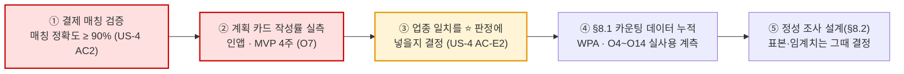
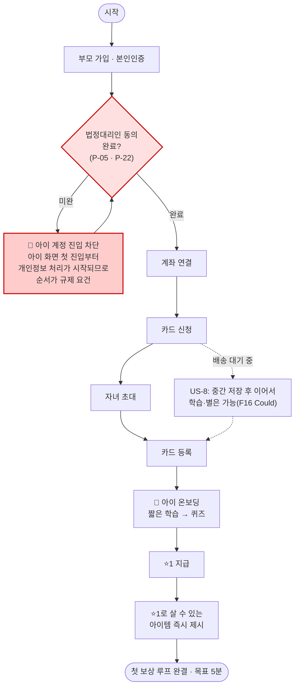
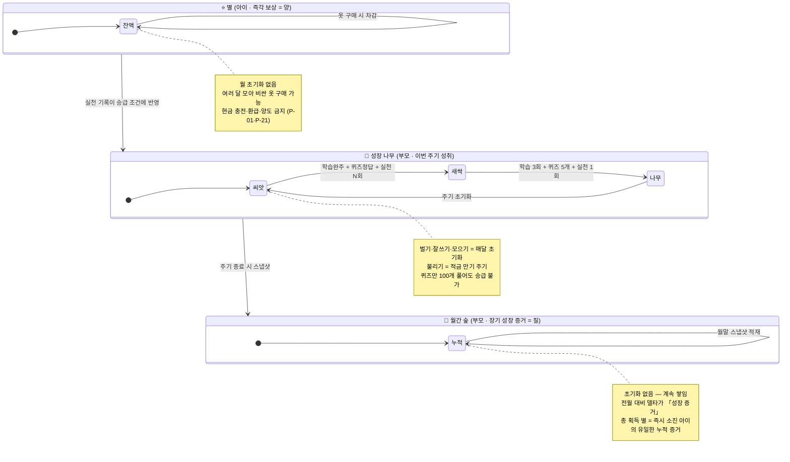
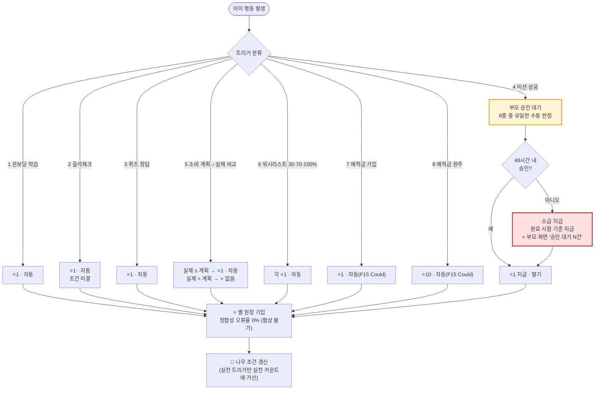
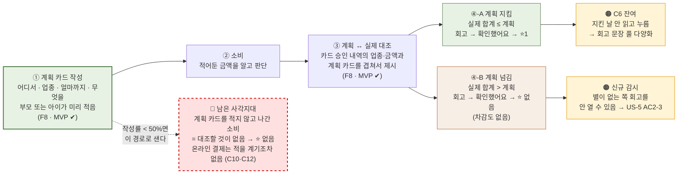

# 핀프렌즈(FinFriends) SRS v1.1 — Software Requirements Specification

- **기준 표준** — ISO/IEC/IEEE 29148:2018(E), *Systems and software engineering — Life cycle processes — Requirements engineering* §8.5.2(SRS 목차 예시) · §9.6(SRS 내용 요구사항)
- **원본 문서** — `PRD_핀프렌즈_v0_3.md` (§ 표기는 원본 PRD의 절 번호를 가리킴)
- **Owner 팀** — 제품기획 유림 / 정책·법령 병윤 / 경쟁·리뷰 하영 / 서비스분석 혜원
- **최종 업데이트** — 2026-08-26
- **판본** — v1.0(2026-08-25 최초 변환) → **v1.1**(2026-08-26 §8 개정: 실험 설계·8슬롯 모집 계획을 KPI 카운팅 계획으로 교체 — MVP 개발 단계에서 표본·판정 임계치를 미리 확정하는 것은 시기상조라는 판단). 변환 이력은 [§13](#13-문서-변경-이력)

### 적합성 선언 (Annex C 재단(Tailoring) 신용)

이 문서는 ISO/IEC/IEEE 29148:2018에 대한 **선택적(tailored) 적합성**을 주장합니다 — **전체 준수(full conformance)를 주장하지 않습니다.**

- **§1~§5**는 표준 §8.5.2(SRS 목차 예시)·§9.6(SRS 내용 요구사항)을 **기준 포맷**으로 그대로 따릅니다.
- 원본 PRD에는 SRS 범위를 넘어서는 내용(사업 목표·이해관계자 Pain·실험 계획·근거·리스크·설계 결정)이 상당량 존재합니다. 이 내용은 삭제하거나 억지로 SRS 항목에 욱여넣지 않고, **§6~§12에 별도 챕터로 유지**하되 각 챕터 제목 아래에 그 챕터가 표준의 어느 절(BRS §9.3 · StRS §9.4 · 요구사항 속성 §5.2.8 등)을 참고했는지 명시했습니다.
- 확장 챕터(§6~§12)의 내용은 **전부 PRD에 이미 작성돼 있던 것**이며, 이 변환 과정에서 새로 발명한 요구사항은 없습니다.

### 등급 표기 (PRD 승계 — 변경 없음)

`[A]` 학술·공공통계 · `[관측]` 팀 직접 확인 · `[추론]` 해석·모델값 · `[가설]` 미검증 · `[설계 확정]` 확정 사양 · `✍️[합성 가설]` 페르소나·여정·Pain · `🧪[모의]` 모의 응답(**Evidence 아님**)

> 🔴 **문서 지위 승계** — 고객 인터뷰 0건. 모든 목표 수치는 **[가설]**, 기준선은 대부분 **⬜ 미측정**입니다. 어느 수치도 성과로 인용할 수 없습니다. 이 등급 표기는 PRD의 인용 금지 정책(§9-2)을 그대로 승계하며, SRS 변환 과정에서 임의로 제거하지 않았습니다.

---

## 0. 용어·코드 사전

> *(ISO/IEC/IEEE 29148 §9.2.3 Definitions · §9.2.5 Acronyms and abbreviations 대응)*

### 0-1. 두 가치 선언

| 코드 | 문장 | 누구의 것 |
|:-:|---|---|
| **선언 ①**<br>*(성장이 일어난다)* | **"핀프렌즈는 자녀가 금융에 대해 학습하고 금융 행동을 실천하며 성장할 수 있습니다."** | 🧒 **아이** — 학습·실천·성장이 아이에게서 일어남 |
| **선언 ②**<br>*(그 성장이 보인다)* | **"핀프렌즈는 자녀가 얼마나 금융 지식을 배웠는지가 아닌, 금융 행동이 어떻게 달라졌는지 한 눈에 보여줍니다."** | 👤 **부모** — 그 결과를 확인 |

**위계** — 선언 ①이 일어나야 선언 ②가 보여줄 것이 생깁니다. 아이가 멈추면 부모 화면은 **빈 상태로 「정상 작동」** 합니다.

### 0-2. 제품이 수행하는 일 (Job)

| 코드 | 읽는 이름 | 뜻 | 대응 선언 |
|:-:|---|---|:-:|
| **J1** | **실천할 자리 만들기** | 배운 것을 실천할 자리를 만들고, 실천이 성장으로 집계되게 한다 | 선언 ①(성장이 일어난다) · 아이 |
| **J2** | **행동 변화 보여주기** | 활동량이 아니라 「행동이 어떻게 달라졌는지」를 한 눈에 보여준다 | 선언 ②(그 성장이 보인다) · 부모 |
| **J3** | **끊김 방지** | 시작·인정·탐지가 끊기지 않게 한다 *(위계의 전제)* | ①→② 연결 |

### 0-3. 고객 문제(Pain) 코드 — 8건

| 층위 | 코드 | 읽는 이름 | 한 줄 뜻 | 인물 |
|:-:|:-:|---|---|:-:|
| ★ **선별** | **C1(성장 증거 부재)** | **성장 증거 부재** | 누적 숫자(116일·75문제·6,650원)가 성장의 증거가 되지 못한다 | 정미경 |
| ★ **선별** | **C2(실천 공백 → 나무 정체)** | **실천 공백 → 나무 정체** | 실천 칸이 비어 4개 나무가 전부 정체한다 | 정미경 |
| ★ **선별** | **C5(사전 개입 사각지대)** | **사전 개입 사각지대** | 소비 직전에 아이를 멈춰 세울 자동 수단이 없다 *(F8 계획 카드로 부분 대응 — §11-1 ADR-001)* | 배성우 |
| ◇ **보조** | **C3(정체 원인 미설명)** | **정체 원인 미설명** | 2주 정체를 부모가 아이의 능력 문제로 해석한다 | 정미경 |
| ◇ **보조** | **C10(FOMO 3초 판단)** | **FOMO 3초 판단** | 한정 스킨 결제는 판단 시간이 3초다 | 강동혁 |
| ◇ **보조** | **C12(온라인 개입 부재)** | **온라인 개입 부재** | 온라인 결제 사전 개입이 설계에 원리적으로 없다 | 강동혁 |
| △ **감시** | **C6(회고 형식화)** | **회고 형식화** | ⭐를 계획 준수 시에만 지급(확정)하여 「참은 날=안 참은 날」 문제는 해소. 남은 것은 **지킨 날에 읽지 않고 누르는 것** | 배성우 |
| △ **감시** | **A1(「불리기」 학습 장벽)** | **「불리기」 학습 장벽** | 이자·복리가 어려워 「불리기」가 학습 단계부터 막힌다 | 오하늘 |
| — | **C4(온보딩 5단계 비용)** | **온보딩 5단계 비용** | 현금 5초 ↔ 온보딩 5단계. 선별은 아니나 로드맵에 남음 | 배성우 |

**층위 표기** — ★ **선별**(3건 · 반드시 해결) · ◇ **보조**(3건 · 같은 해법으로 함께 풀림) · △ **감시**(2건 · 선언에 걸려 있으나 지표는 낮음)

### 0-4. 인물 (페르소나)

| 코드 | 읽는 이름 | 한 줄 |
|:-:|---|---|
| **H1** | **정미경**(39 · 중학교 교사) | 퍼핀 8개월차 — 숫자는 쌓이는데 확신은 안 쌓임 |
| **H2** | **배성우**(42 · 카페 자영업) | 현금 봉투 3년 — 소비 데이터가 아예 없음 |
| **H4** | **강동혁**(45 · 주 양육자) | 게임 결제로 용돈 60% 증발 *(보조 Pain 인물)* |
| **H5** | **오하늘**(38 · 약사) | 낭비는 안 하는데 모을 이유가 없음 *(감시 Pain 인물)* |
| **H6** | **임태경**(43 · 물류) | 지출 통제가 목적 — 🔴 **범위 밖으로 결정** |
| **H7 · H8** | 백현주 · 서명숙 | 승인 지연·부재 *(포용성 · 여정에서 P0)* |
| **H10** | 신가영(41 · 은행원) | 아이부자 2년차 — 불만이 없음 *(전환 검증용)* |

### 0-5. 지표 · 실험 · 기능 코드

| 접두 | 뜻 | 예 |
|:-:|---|---|
| **WPA** | **Weekly Practiced Active** — 주간 실천 인정 아동 비율 *(북극성 지표)* | §6-2 |
| **O1~O14** | **Outcome** — 고객이 원하는 결과의 정량 지표 | O4 = 7일 내 첫 실천 인정률 |
| **F1~F17** | **Feature** — 기능 번호 | §3-1 |
| **US-1~US-8** | **User Story** — 사용자 스토리 | US-2 = 첫 실천이 나무에 반영된다 |
| **AC / AC-E** | **Acceptance Criteria** — 수용 기준 / **AC-E** = 예외·실패 케이스 기준 | US-6 AC-E2 |
| **P-01~P-23 · F-01** | **정책·법령 조항** — 규제 상수 | P-17·P-18 = 카드 한도·업종 제한 |
| **①~④ 세그먼트** | 시장 세그먼트 | ① 금융성장 증명형(29.3만명 · 1차 타깃) |

### 0-6. 일반 약어

| 약어 | 풀어쓰면 |
|:-:|---|
| **MVP** | Minimum Viable Product — 최소 기능 제품(F1~F13 13개) |
| **KPI** | Key Performance Indicator — 핵심 성과 지표 |
| **NFR** | Non-Functional Requirement — 비기능 요구사항 |
| **SLO** | Service Level Objective — 서비스 수준 목표 |
| **Must·Should·Could·Won't** | 기능 우선순위 4단계(MoSCoW) |
| **AOS · DOS** | Attractive/Dissatisfied Opportunity Score |
| **PASS · HOLD · FAIL** | 판정 3구간 — 통과 / 보류 / 실패 |
| **p95** | 95번째 백분위 |
| **Cohen's κ** | 코더 2인의 판정 일치도 계수(0.6 이상 요구) |
| **ADR** | Architecture Decision Record — 설계 결정 기록(§11) |

---

## 1. Introduction

> *(ISO/IEC/IEEE 29148 §8.5.2 SRS 목차 §1 대응)*

### 1.1 Purpose *(§9.6.2)*

핀프렌즈는 아동 대상 용돈·금융 학습 앱이다. 이 SRS는 `VPS v2.0 rooted`(자립 리서치 문서)의 결론을 **구현 가능한 소프트웨어 요구사항으로 번역**한 PRD v0.3을 표준 SRS 형식으로 재구성한 것이며, 새 리서치나 새 요구사항을 포함하지 않는다.

### 1.2 Scope *(§9.6.3)*

| | 내용 |
|---|---|
| **In** | 앱으로 충전된 용돈의 흐름 — 벌기 → 잘 쓰기 → 모으기 → 불리기 · 학습 4주제 + 퀴즈 · 실천 판정(미션·회고·위시리스트) · 별·옷장 · 성장 나무·월간 숲 · 소비 내역 · 부모 온보딩·동의 · 소급 지급 · 미접속 알림 |
| **Out** *(제품 정책상 영구 제외)* | 앱 외부에서 오간 현금(세뱃돈·친척 용돈) · 친구 기능 · 모의투자 · 미션 사진 인증 |
| **Out** *(이번 릴리즈)* | 위치 알림(F14) · 예적금 실천(F15) · 카드 없는 체험(F16) · 별의 옷장 외 목적지(F17) · 기록 이전(F18) · 소비 사전 개입 자동 트리거(F19) — **삭제 확정, F8 계획 카드로 흡수**(§11-1 ADR-001) |

### 1.3 Product overview

#### 1.3.1 Product perspective *(§9.6.4)*

핀프렌즈는 독립 실행형 모바일 앱이 아니라, **선불업 등록을 보유한 제휴사에 카드 발행·가맹점망·이용한도를 의존**하는 구조다. 핀프렌즈가 소유하는 것은 브랜드·앱·4칸 학습·실천 시스템·성장 나무·월간 숲·별 원장·실천 판정 로직이고, 제휴사가 소유하는 것은 선불전자지급수단 발행·관리·선불충전금 별도관리·카드 발행·가맹점망·이용한도(P-17·P-18)다. 이 경계와 인터페이스의 상세는 §3.4.1에 정의한다.

만 14세 미만은 마이데이터 가입이 불가능해(F-01) 표준 오픈뱅킹 연동을 쓸 수 없으며, 이 제약이 위 폐쇄형 구조를 채택한 근거다(§11-3 ADR-003).

#### 1.3.2 Product functions *(§9.6.5)*

| F | 기능 | 우선순위 |
|---|---|:-:|
| F1 | 🌳 성장 나무(4영역 + 실천 근거 + 정체 원인 표시) | Must |
| F2 | 🧹 미션 루프 | Must |
| F3 | 📚 학습 커리큘럼 4주제 + 퀴즈 | Must |
| F4 | ⭐ 별 지급 엔진(트리거 8종) | Must |
| F5 | 🐾 아바타 · 👕 옷장 | Must |
| F7 | 🔐 부모 온보딩 + 법정대리인 동의 | Must |
| F8 | 📝 소비 계획 카드 + 💳 계획↔실제 대조 | Must |
| F9 | 🌲 월간 숲(지난달과 비교) | Must |
| F6 | 🐣 아이 온보딩 | Should |
| F10 | ⏱ 승인 지연 시 ⭐ 소급 지급 | Should |
| F11 | 🔔 아이 3일 미접속 알림 | Should |
| F12 | 🎯 위시리스트 | Should |
| F13 | 📊 소비 내역 | Should |
| F15 | 💰 예적금 비교·선택 | Could |
| F16 | 🪪 카드 없는 체험 | Could |
| F17 | 🛍 별의 옷장 외 목적지 | Could |
| ~~F14~~ | ~~위치 알림~~ | ❌ 삭제 |
| ~~F19~~ | ~~사전 개입 2차 트리거~~ | ❌ 삭제 |
| F18 | 📤 기존 앱 기록 이전 | Won't |

전체 명세는 §3.1을 참조.

#### 1.3.3 User characteristics *(§9.6.6)*

| 인물 | 특성 |
|---|---|
| **H1 정미경**(39·중학교 교사) | 퍼핀 8개월차, 아이 전용 태블릿, 앱 확인 당일 응답 — 선별 C1·C2 |
| **H2 배성우**(42·카페 자영업) | 현금 봉투 3년, 아이 기기 키즈워치, 확인 주 1회 — 선별 C5 |

두 인물은 동일 시장 세그먼트 ①(금융성장 증명형, 29.3만명) 안에 있다. 상세 페르소나·여정 매핑은 §7을 참조.

#### 1.3.4 Limitations *(§9.6.7)*

- 「불리기」 실천 경로는 F15(Could)가 P-20(예적금 가입 중개 회피) 법률 검토를 통과하기 전까지 학습만 열리고 실천은 닫혀 있다.
- 자동 사전 개입 수단은 0개다 — F14·F19 삭제 확정, 대신 F8 계획 카드가 사전 수단이다. 온라인 결제·FOMO 3초 판단(C10·C12)은 대응 기능이 없다.
- 기존 앱 기록 이전은 지원하지 않는다(F18 Won't).

### 1.4 Definitions

→ §0(용어·코드 사전) 참조.

---

## 2. References

> *(§9.2.4)*

| 문서 | 비고 |
|---|---|
| `VPS v2.0 rooted` | 자립 리서치 문서(1,089줄) — 이 SRS·원본 PRD의 근거 문서 |
| `PRD_핀프렌즈_v0_3.md` | 이 SRS의 직접 원본 |
| `PRD_핀프렌즈_v0_1_품질리뷰.md` | PRD v0.1→v0.2 결함 리뷰(측정·검증 가능성 결함 11건) |
| ISO/IEC/IEEE 29148:2018(E) | 이 SRS의 기준 표준(요구사항 정의·정보 항목 형식) |
| P-01~P-23 · F-01 | 내부 규제 조항 코드 — §3.6 · §0-5 참조 |
| v13 기능정의서 · 가치제안서 | F 번호·MVP 컷라인의 원 출처(PRD가 승계) |

---

## 3. Requirements

> *(§9.6.9~§9.6.18 대응)*

### 3.1 Functions *(§9.6.12)*

> 표준 5.2.4는 "condition-action table과 use case도 요구사항을 기술하는 수단"으로 인정한다. 아래 사용자 스토리·Given/When/Then·수용 기준(AC)이 이 SRS의 기능 요구사항 본문이다.

#### 3.1.1 기능 목록 및 우선순위

| F | 기능 | 연결 Pain | Job | 중요도 | 난이도 | 우선순위 | 근거 |
|---|---|:-:|:-:|:-:|:-:|:-:|---|
| **F1** | 🌳 성장 나무 (4영역 + 실천 근거 기본 노출 + 정체 원인 표시) | ★ C1 ◇ C3 | J2 | 5 | 4 | **Must** | 퍼핀은 숫자 3개뿐 — 「어디까지 자랐나」를 보여주는 유일한 화면 |
| **F2** | 🧹 미션 루프 (조건·금액 사전 설정 → 승인 → ⭐1) | ★ C2 | J1 | 5 | 3 | **Must** | 「벌기」의 유일한 실천 근거 |
| **F3** | 📚 학습 커리큘럼 4주제 + 퀴즈 (+「불리기」 한 줄 설명) | ★ C2 △ A1 | J1 | 5 | 3 | **Must** | 4/4 전부 금융 vs 퍼핀 3/7 |
| **F4** | ⭐ 별 지급 엔진 (트리거 8종 · 차감형 · 초기화 없음) | ★ C2 | J1 | 5 | 3 | **Must** | 실천 5경로 vs 학습 2경로 |
| **F5** | 🐾 아바타 · 👕 옷장 (사전 제작 3D) | ★ C2 | J1 | 5 | 4 | **Must** | 아이의 유일한 동기 장치 |
| **F7** | 🔐 부모 온보딩 5단계 + 법정대리인 동의 | C4 | J3 | 5 | 4 | **Must** | 규제 필수(P-05·P-22) |
| **F8** 🆕 | 📝 소비 계획 카드(어디서·업종·얼마·무엇을) + 💳 계획↔실제 업종별 대조 (두 갈래 — 지킴 ⭐1 / 넘김 회고만) | ★ C5 △ C6 | J1 J2 | 5 | **5** | **Must** | F14·F19를 흡수한 기능 — 사전+사후를 한 기능이 담당 |
| **F9** | 🌲 월간 숲 (지난달과 비교) | ★ C1 | J2 | 5 | 3 | **Must** | 전월 대비 변화가 성장 증거 — 3사 전부 공백 |
| **F6** | 🐣 아이 온보딩 (학습→퀴즈→⭐1→아이템 제시) | C4 | J1 J3 | 4 | 2 | **Should** | 첫 보상 루프를 5분에 닫음 |
| **F10** | ⏱ 승인 지연 시 ⭐ 소급 지급 + 「대기 N건」 | US-6 | J1 J2 | 4 | 2 | **Should** | H7·H8의 P0 |
| **F11** | 🔔 아이 3일 미접속 알림 | US-7 | J3 | 4 | 2 | **Should** | O13의 유일한 달성 수단 |
| **F12** | 🎯 위시리스트 (30·70·100% 각 ⭐1) | ★ C2 | J1 | 4 | 2 | **Should** | 「모으기」 칸을 여는 실천 |
| **F13** | 📊 소비 내역 (전월 대비 증감액 상단 · 업종별 집계) | ★ C5 | J2 | 4 | 2 | **Should** | H2의 최소 유지 조건 |
| ~~**F19**~~ | ~~🚦 소비 사전 개입 2차 트리거~~ | — | — | — | — | ❌ **삭제** | 사전 수단을 F8로 이관(§11-1) |
| **F15** | 💰 예적금 비교·선택 (가입 ⭐1 · 완주 ⭐10) | △ A1 | J1 | 3 | 3 | **Could** | 「불리기」 실천 칸 — P-20 선행 |
| **F16** | 🪪 카드 없이 학습부터 시작하는 체험 경로 | C4 | J3 | 3 | 3 | **Could** | H2 진입 장벽(시간) 완화 |
| **F17** | 🛍 별의 옷장 외 목적지 | (A2) | J1 | 3 | 3 | **Could** | 모으기형 아이 루프 회수 — P-21 재검토 선행 |
| ~~**F14**~~ | ~~📍 위치 알림 (3분 체류 · 온디바이스)~~ | — | — | — | — | ❌ **삭제** | 기기 전제·규제 부담·사각지대가 모두 남아 폐기 |
| **F18** | 📤 기존 앱 기록 이전 / 병행 사용 | (H1 Anxiety) | J3 | 2 | **5** | **Won't** | 난이도 5 · 병행 수요 낮음 |

**집계** — Must 8 · Should 5 · Could 3 · Won't 1 = 17개

#### 3.1.2 스프린트 실현성

> ⚠️ 가정 — 팀 벨로시티 미확정, 1스프린트=2주를 잠정 기준으로 판정.

| F | 난이도 | 스프린트 판정 | 사유 |
|---|:-:|---|---|
| F1 | 4 | ⚠️ 분해 필요(2스프린트) | 기본 렌더+근거노출 → 정체원인 판정 로직 분리 |
| F2 | 3 | ✅ 1스프린트 | 단일 흐름 |
| F3 | 3 | ⚠️ 개발·콘텐츠 분리 트랙 | 퀴즈엔진 1스프린트, 콘텐츠 제작은 병행 트랙 |
| F4 | 3 | ⚠️ 분해 필요(2스프린트) | 트리거 판정 로직 + 정합성 0% 검증용 이중기입·정산배치 분리 |
| F5 | 4 | ⚠️ 에셋 제작 별도 트랙 | 3D 에셋은 디자인 트랙, 착탈 로직은 1스프린트 |
| F7 | 4 | ⚠️ 분해 필요(2스프린트) | UI 1스프린트 + 동의 게이트 자동테스트 100% 확보 |
| F8 | 5 | 🔴 분해 필요(3스프린트) | 카드CRUD → 결제매칭(정확도≥90%) → 두 갈래 회고 UX |
| F9 | 3 | ✅ 1스프린트 | F1 완료 후 착수 |
| F6 · F10 · F11 · F12 | 2 | ✅ 1스프린트 | — |
| F13 | 2 | ✅ 1스프린트 | F8 이후 착수 |
| F15 | 3 | 🔴 스프린트 편성 불가 | P-20 법률 검토 선행 — 외부 의존성이 병목 |
| F16 | 3 | ✅ 1스프린트 | — |
| F17 | 3 | 🔴 스프린트 편성 불가 | P-21 재검토 선행 |

#### 3.1.3 사용자 스토리 및 수용 기준(AC)

**AC 판정 규칙**

- **정수 임계치 환산** — n=8 인터뷰 지표는 비율(%) 대신 `k/8`로 표기(예: ≥70% → ≥6/8).
- **코딩 규칙** — 「변화 회상」 성공 = 응답에 비교시점·변화방향·대상 3요소 포함, 코더 2인 독립 코딩, **Cohen's κ ≥ 0.6**. 불일치 시 제3자 판정.
- **표본 미확보 시** — n≥8 정상판정 · 5≤n<8 HOLD 고정(PASS 불가) · n<5 판정불가.
- **3구간 판정** — ✅ PASS(통과선 이상) · ⚠️ HOLD(회색지대, 표본+4 후 재판정, 2회 연속 HOLD→FAIL) · ✕ FAIL(실패선 이하, 재설계).

**US-1 — 변화를 한 문장으로 읽는다** `J2` `★C1`
> As a H1 정미경(부모), I want 화면을 열었을 때 무엇이 달라졌는지를 읽고, so that 아이가 배운 것이 행동으로 이어졌는지 짧은 시간에 확인할 수 있다.

| # | Given / When / Then | 측정 도구 |
|:-:|---|---|
| AC1 | Given 이번 달 실천 기록 1건 이상 / When 성장 나무 5초 노출·덮기 / Then 1문장 회상 ≥6/8 | 인터뷰 T3 n=8 |
| AC2 | Given 나무 기본 상태 / When "나무가 자랐다는 건 무슨 뜻인가" 질문 / Then 개입 0회로 「실천」 도달 ≥6/8 | 인터뷰 Q1-8 |
| AC3 | Given 전월 데이터 존재 / When 월간 숲에서 "지난달과 다른 점" 탐색 / Then 60초 내 3개 이상 지목 ≥6/8, 확인시간 중위 ≤3분 | 인터뷰 Q1-10 |
| AC4 | Given 별 잔액 0인 계정 / When 월간 숲 진입 / Then "이번 달 획득 별" 스크롤 없이 노출, 누적 성과 지목 ≥6/8 | 인터뷰 Q1-11 |
| **AC-E1** | Given 이번 달 실천 0건 / When 성장 나무 진입 / Then "아직 기록 없어요+첫 실천 안내" 표시, 결함 오인 ≤2/8 | 인터뷰·화면검수 |
| **AC-E2** | Given 가입 첫 달(전월 데이터 없음) / When 월간 숲 진입 / Then "다음 달부터 비교 가능" 대체 문구, 델타 0 렌더 금지 | 화면 검수 |

**US-2 — 첫 실천 한 건이 나무에 반영된다** `J1` `★C2`
> As a 정하율(아이), I want 처음 실천한 한 건이 눈에 보이게 반영되고, so that 계속할 이유가 생긴다.

| # | Given / When / Then | 측정 도구 |
|:-:|---|---|
| AC1 | Given 가입 7일 이내 / When 실천 트리거 5종 중 1종 최초 완료 / Then ⭐지급+나무진행도 동일세션 반영, 가입7일내 첫실천인정률 ≥60% | `practice_credited` 로그 |
| AC2 | Given 학습만 완료·실천 0건 / When 퀴즈 추가 / Then 나무 단계 상승 안 함, "실천 N회 남음" 표시 | 단위테스트+화면검수 |
| AC3 | Given 여정 6단계 / When 월말 집계 / Then 4칸 중 2칸 이상 성장 가정 ≥50%, 4칸 전부 정체 ≤15% | 인앱 집계 |
| AC4 | Given 「불리기」 실천 경로 닫힘(F15 제외) / When 「불리기」 칸 진입 / Then "곧 열려요" 안내, 결함 오인 방지 | 화면검수·인터뷰 |
| **AC-E1** | Given 아동 기기 오프라인 / When 실천 완료 후 재연결 / Then ⭐ 중복지급 0건, 반영 ≤60초, 주차귀속은 client_ts 기준 | 단위테스트 |
| **AC-E2** | Given 동일 미션 승인요청 2회 이상 / When 부모가 각각 승인 / Then ⭐는 1회만 지급, 원장 불일치 0건 | 단위테스트 |
| **AC-E3** | Given 실천은 충족·학습·퀴즈 미충족 / When 나무 화면 진입 / Then 승급 안 함, 남은 조건 개별 표시 | 단위테스트+화면검수 |

**US-3 — 멈춘 이유를 화면에서 안다** `J2` `◇C3`
> As a H1 정미경(부모), I want 나무가 멈췄을 때 이유가 아이 탓인지 조건 탓인지 구분되고, so that 실망을 아이에게 돌리지 않고 앱도 계속 신뢰할 수 있다.

| # | Given / When / Then | 측정 도구 |
|:-:|---|---|
| AC1 | Given 특정 칸 14일 이상 미상승 / When 부모가 그 칸 진입 / Then 정체 원인 조건 단위 표시, 열람률 ≥60% | 인앱 화면 로그 |
| AC2 | Given 동일 상황 / When "무슨 일이 있었다고 생각하나" 질문 / Then 오귀인 발화 ≤2/8, 앱불신 발화 ≤2/8 | 인터뷰 Q1-9(κ≥0.6) |
| AC3 | Given 정체 원인 표시 열람 / When 다음 주 재방문 / Then 정체 계정 익주 재방문율 ≥50% | 인앱 세션 로그 |
| **AC-E1** | Given 정체 원인 복수 / When 원인 표시 / Then 전부 표시하되 「가장 적게 남은 조건」 최상단 | 화면 검수 |
| **AC-E2** | Given 주기 초기화 직후(정상 상태) / When 화면 진입 / Then 「정체」로 표시 안 함, 오탐 0건 | 단위테스트 |

**US-4 — 📝 쓰기 전에 미리 적어둔다** `J1` `★C5`
> As a 배주안(아이), I want 가게 가기 전 어디서·업종·얼마까지·무엇을 적어두고, so that 쓰고 나서 그 카드와 실제 결제를 겹쳐 볼 수 있다.

| # | Given / When / Then | 측정 도구 |
|:-:|---|---|
| AC1 | Given 계획 카드 작성 화면 / When 어디서·업종·얼마까지 입력 / Then 카드 저장, 업종은 카드승인데이터 업종코드와 대조 가능값 | 단위테스트+화면검수 |
| AC2 | Given 계획 카드 존재 / When 카드결제 발생 / Then 자동 매칭, 정확도 ≥90% | 매칭로그+수동대조 50건 |
| AC3 | Given 계획 카드 없이 결제 발생 / When 앱 진입 / Then 대조화면 대신 "다음엔 가기 전에 적어볼까요?" 유도, ⭐ 미지급 | 단위테스트+화면검수 |
| **AC4**(생존조건) | Given MVP 4주 운영 / When 작성률 집계 / Then 카드결제건 대비 작성률 ≥50%(O7) | `plan_card_created`÷`payment_settled` |
| **AC-E1** | Given 한 카드에 여러 결제 매칭 / When 대조화면 생성 / Then 합계로 판정, 업종별 내역 전부 나열 | 단위테스트 |
| **AC-E2** | Given 계획 업종과 다른 업종에서만 결제(금액은 계획 이내) / When 대조화면 생성 / Then ⬜ 판정 미결 — 업종 일치를 ⭐판정에 넣을지 팀 결정 대기 | 🔴 팀 결정 대기 |

**US-5 — 참은 날이 확인만 한 날과 다르다** `J1` `△C6`
> As a 배주안(아이), I want 참은 날이 확인만 한 날과 다르게 느껴지고, so that 참는 쪽이 더 좋은 선택으로 학습된다.

| # | Given / When / Then | 측정 도구 |
|:-:|---|---|
| AC1 | Given 7일 내 회고 3회 이상 / When 회고 문장 제시 / Then 동일 문장 재노출률 ≤2/8 | 문장배정로그 |
| AC2 | Given 회고 진입 / When [확인했어요] 클릭 / Then 체류 중위 ≥3초, 1초 미만 ≤20% | 화면체류로그 |
| **AC2-1**(갈래A·지킴) | Given 실제≤계획 / When 확인 / Then ⭐1 지급, plan_met=true | 단위테스트+이벤트 |
| **AC2-2**(갈래B·넘김) | Given 실제>계획 / When 확인 / Then ⭐ 미지급(차감도 없음), plan_met=false | 단위테스트+이벤트 |
| **AC2-3**(갈래B 이탈감시) | Given 계획초과로 무보상 / When 회고 대기 / Then 회고열람률 ≥계획준수건 대비 70% | `retro_viewed` 갈래별 |
| AC3 | Given 초과일·준수일 각각 | When 회고 완료 / Then 문장 구별되고 부모가 화면만으로 구분 ≥6/8 | 화면검수+인터뷰 |
| **AC-E1** | Given 문장 풀 잔여 20% 이하 / When 다음 배정 / Then 운영 알림 발송, 풀 확장 전 재사용 금지 | 문장풀 모니터 |
| **AC-E2** | Given 회고 미완+다음 소비 발생 / When 앱 진입 / Then 큐에 순서대로 제시, 3건 초과 시 요약 회고로 병합 | 단위테스트+화면검수 |

**US-6 — 부모가 늦어도 내가 한 일이 사라지지 않는다** `J3`
> As a 아이(H7·H8형 포함), I want 부모 승인이 늦어도 실천이 인정되고, so that 부모의 지연이 내 실패로 기록되지 않는다.

| # | Given / When / Then | 측정 도구 |
|:-:|---|---|
| AC1 | Given 완료 후 미승인 48시간 경과 / When 부모 승인 / Then 완료시점 기준 소급지급, 성공률 100% | 이벤트+단위테스트 |
| AC2 | Given 승인 대기 1건 이상 / When 성장 나무 진입 / Then "승인 대기 N건" 표시 | 화면검수·인터뷰 |
| AC3 | Given 아이 화면 / When 대기 상태 확인 / Then 「대기 중」이 「미실천」과 시각적 구별 | 화면검수 |
| **AC-E1** | Given 부모가 거절 / When 거절 확정 / Then ⭐ 미지급, "승인되지 않음+사유" 표시, 실천카운트 미가산 | 이벤트+화면검수 |
| **AC-E2** 🔴 | Given 완료시점 주기 종료 후 승인 / When 소급 실행 / Then ⭐는 지급하되 나무조건은 완료시점 주기(N)에 귀속, 월간숲 스냅샷 반영 | 단위테스트 |
| **AC-E3** | Given 승인 대기 5건 이상 / When 일괄 승인 / Then 각 건 완료시각 기준 개별 소급 | 단위테스트 |

**US-7 — 아이가 멈춘 것을 3일 안에 안다** `J3`
> As a 부모(H2형 포함), I want 아이가 앱을 안 열면 곧 알게 되고, so that 다음 달 충전 시점에야 알고 결론 내리지 않는다.

| # | Given / When / Then | 측정 도구 |
|:-:|---|---|
| AC1 | Given 최종접속 후 72시간 / When 배치 실행 / Then 미접속 알림 발송률 100%, 정지→인지 ≤3일 | F11 발송·열람 로그 |
| AC2 | Given 알림 수신 / When 부모가 열람 / Then 멈춘 지점(칸·조건) 함께 표시 | 화면검수 |
| AC3 | Given 야간에만 확인 가능 / When 알림 발송 / Then 발송 시간대 조정 가능, 열람률 ≥50% | 인앱설정+열람로그 |
| **AC-E1** | Given 푸시 차단 / When 72h 판정 / Then 앱내 배너+문자 대체, 차단상태 계측 | 권한상태+이벤트 |
| **AC-E2** | Given 앱 삭제 / When 72h 시점 / Then "재설치 안내"로 분기, 다른 이벤트코드 | 이벤트코드검수 |
| **AC-E3** | Given 71시간 시점 재접속 / When 배치 실행 / Then 알림 미발송, 오탐 0건 | 단위테스트 |

**US-8 — 시간을 쪼개서 시작할 수 있다** `J3` `C4`
> As a H2 배성우(자영업 부모), I want 온보딩을 한 번에 끝내지 않아도 되고, so that 가게 일 사이에 나눠서 시작할 수 있다.

| # | Given / When / Then | 측정 도구 |
|:-:|---|---|
| AC1 | Given 온보딩 2단계 진행 / When 재진입(다음날) / Then 직전 단계 이어서, 재입력 0건 | 이벤트+단위테스트 |
| AC2 | Given 카드 배송 대기 / When 앱 진입 / Then 학습·퀴즈·별 획득 가능, 카드필요 기능만 잠금 | 화면검수 |
| AC3 | Given 온보딩 시작 / When 완주 소요 측정 / Then 총소요 중위 ≤10분, 3단계 이탈률 ≤30% | 퍼널 |
| **AC-E1** | Given 카드신청 단계 API 실패 / When 오류 반환 / Then 입력값 24시간 보존, 재입력 0건 | 단위테스트+화면검수 |
| **AC-E2** | Given 온보딩 중 세션만료 / When 재로그인 / Then 직전 완료단계 재개, 동의는 재확인(캐시 안 함) | 단위테스트 |

#### 3.1.4 확정 결정 — F14·F19 삭제, F8 흡수

> 전체 배경·근거·트레이드오프는 [§11-1 ADR-001](#11-설계-결정-기록-adr)에 정리했다. 핵심만 요약:

- **확정** — 자동 트리거를 만들지 않고, 사전 개입을 「쓰기 전에 적는 행위」(F8)로 이관.
- **대가** — 자동 발동 소멸(사각지대는 「계획을 적지 않은 소비」로 이동), C10·C12 완전 미대응.
- **생존 조건** — 계획 카드 작성률(O7·AC4, §8.1) ≥50% 미만이면 F8의 사전·사후 절반이 모두 무너짐.

#### 3.1.5 MVP 공백과 대응

| 사실 | 대응 |
|---|---|
| 「불리기」 칸은 학습만 열리고 실천은 닫힘(F15 Could) | "곧 열려요" 표시 필수 |
| 자동 사전 개입 0개 | §3.1.4 사유 명시, "매장에 3분 머무르면 알림" 대외 사용 금지, 생존조건은 계획 카드 작성률 |
| 기록 이전 불가(F18 Won't) | 획득 메시지를 「이전」이 아니라 「지금부터」 프레임으로 |

### 3.2 Performance requirements *(§9.6.14)*

> 🔴 확정 SLO가 아니라 **AC에서 역산한 잠정 상한**이다 — AC가 성립하지 않는 값은 어떤 경우에도 허용될 수 없기 때문(§11-6 ADR-006).

| 항목 | 잠정 상한 | 유도 근거(AC 역산) | 측정 방법 | 재설정 트리거 |
|---|:-:|---|---|---|
| 성장 나무 p95 렌더 | ≤1,250ms | US-1 AC1의 5초 노출 25% 초과 시 회상테스트 오염 | `tree_view_opened` p95/주 | p95 3일연속 초과 → 재검토 |
| 월간 숲 p95 렌더 | ≤2,000ms | US-1 AC3의 60초의 3% | `forest_view_opened` p95/주 | 동일 |
| 별 지급 반영 p95 | ≤800ms | US-2 AC1 "동일세션 반영" | `practice_credited`→화면반영 p95/일 | 동일 |
| 오프라인 재연결 후 반영 | ≤60s | US-2 AC-E1 명시 | 재연결~반영 p95/일 | AC 확정치 |
| 월 가용성 | ≥99.0%(잠정) | 제휴사 SLA보다 높을 수 없음 | 월간 5분단위 프로브 | 제휴사 SLA 확인 시 min(목표,SLA) |
| API 오류율(별 제외) | ≤0.5%(잠정) | 일반 모바일 관행값 | (5xx+타임아웃)/전체·일간 | 3일연속 초과 → 릴리즈 중단 |
| 🔴 별 지급·차감 정합성 오류율 | 0% | 협상 불가 | 이중기입+일일정산 | 없음(불변) |
| 소급 지급 성공률 | 100% | US-6 AC1·AC-E2 | 자동테스트+이벤트 | 없음(불변) |
| 미접속 알림 발송 지연 | ≤6h | — | p95/주 | — |

### 3.3 Usability requirements *(§9.6.13)*

- **아동 언어 고지(P-12)** — 4칸 명칭은 부모·아이 동일, 「알기 쉬운 언어」는 한 줄 설명이 담당. 검증: 문구 검수 + 아동 이해도 확인.
- **변화 전달 사용성(O1·O2)** — 나무 5초 노출 후 회상 성공률 ≥6/8, 부모 주 1회 확인 소요시간 목표 3분(§6-2 목표 참조).
- **정체 원인 이해 가능성(O10)** — 정체 원인 표시 열람률 ≥60%.

### 3.4 Interface requirements

#### 3.4.1 External interface requirements *(§9.6.11)*

**제휴사 API 경계 — 선불업 B안**

```
[핀프렌즈]                            [제휴사 — 선불업 등록 보유]
브랜드 · 앱 · 4칸 학습·실천 시스템   ↔   선불전자지급수단 발행·관리
성장 나무 · 월간 숲 · 별 원장             선불충전금 100% 별도관리
실천 판정 로직                            카드 발행 · 가맹점망
                                          🔴 이용한도 · 업종 제한 (P-17·P-18)
```

| 인터페이스 | 입력 | 출력 | 제약 |
|---|---|---|---|
| 충전 요청 | 보호자_id · 금액 | 충전 결과 · 잔액 | 한도는 제휴사 정책 종속 |
| 결제 내역 조회 | 아동 카드 id · 기간 | 거래 목록(시각·금액·가맹점 분류) | 🔴 가맹점 분류 상세도가 회고 품질을 좌우 — 계약 시 확인 필요 |
| 해지·환불 | 아동 카드 id | 환불 결과 | 전액 환불(P-11) |

#### 3.4.2 Internal interface requirements

**인앱 이벤트 명세**

| 이벤트명 | 발생 시점 | 필수 필드 | 산출 지표 |
|---|---|---|---|
| `practice_credited` | 실천 트리거로 ⭐ 지급 확정 | child_id · trigger_code(4·5·6·7·8) · earned_at · awarded_at · approval_mode · tree_slot | WPA(북극성) · O4 · O6 |
| `star_ledger_entry` | 별 증감 확정 | child_id · delta · trigger_code · balance_after · idempotency_key | 별 정합성 오류율 · O8 |
| `tree_state_changed` | 나무 단계·조건 갱신 | child_id · slot · stage_before/after · cond_learn/quiz/practice · stall_days | O5 · C3 정체일수 |
| `tree_view_opened` | 부모가 성장 나무 진입 | parent_id · dwell_ms · evidence_expanded · stall_reason_shown | O10 |
| `forest_view_opened` | 부모가 월간 숲 진입 | parent_id · year_month · delta_items_rendered · dwell_ms | O2 · O14 · §9-3 |
| `retro_viewed` | 회고 화면 진입~이탈 | child_id · sentence_id · dwell_ms · plan_amount · actual_amount · plan_met · star_granted | C6 · 계획준수율 |
| `approval_state_changed` | 미션 승인/거절/소급 | mission_id · state · delay_hours · cycle_id | US-6 소급 성공률 |
| `inactivity_notified` | 3일 미접속 알림 발송 | parent_id · child_id · last_session_at · sent_at · opened_at | O13 · F11 |
| `onboarding_step` | 온보딩 단계 진입/완료/이탈 | parent_id · step(1~5) · state · resumed | US-8 퍼널 |
| `consent_gate_blocked` | 동의 미완 상태 진입 차단 | parent_id · attempted_at | 🔴 규제 알림 |

> **적재 규칙** — 모든 이벤트에 `idempotency_key`, `client_ts`/`server_ts` 필수. 오프라인 이벤트는 `client_ts` 기준 주차 귀속.

### 3.5 Logical database requirements *(§9.6.15)*

**핵심 엔터티**

| 엔터티 | 주요 필드 | 비고 |
|---|---|---|
| 보호자 계정 | id · 인증정보 · 법정대리인 동의 상태/일시 · 알림 시간대 설정 | 동의 상태가 아이 계정 활성화의 게이트 |
| 아동 계정 | id · 보호자_id · 생년(만 나이) · 기기 유형(전용폰/키즈워치/공유/없음) | 기기 유형은 참고 정보로만 유지(§7-2 R2 · ADR-001) |
| 학습 이수 | 아동_id · 주제 · 완주 여부 · 퀴즈 정답 수 | 4주제 고정 |
| 실천 판정 | 아동_id · 경로 · 판정 시각 · 판정 방식(자동/부모승인) · 승인 지연 시간 | WPA 산출의 원천 테이블 |
| 별 원장 | 아동_id · 증감 · 트리거 코드(1~8) · 잔액 · 사유 | 이중 기입 · 초기화 없음 · 현금 전환 필드 부재 |
| 나무 상태 | 아동_id · 칸 · 단계 · 조건 충족 · 주기 시작일 · 정체 일수 | 정체 일수가 정체 원인 표시의 입력 |
| 월간 숲 스냅샷 | 아동_id · 연월 · 4칸 최종 단계 · 학습/실천/소비 집계 · 전월 대비 델타 · 총 획득 별 | 초기화되지 않고 누적 |
| 소비 내역 | 아동_id · 계획 금액 · 실제 결제 금액 · 가맹점 분류 · 회고 상태 · 회고 문장 id | 회고 문장 id가 C6 재노출률 계산에 쓰임 |

**데이터 제약**

- 만 14세 미만 마이데이터 가입 불가(F-01) → 표준 오픈뱅킹 연동 불가, 자체 카드 발급 + 폐쇄형 수집 구조 필수(§11-3 ADR-003)
- 앱 외부 현금은 범위 제외 → 수동 입력에 의존하면 성장 기록의 정확성이 훼손됨

### 3.6 Design constraints *(§9.6.16)*

> 규제 상수는 설계 변수가 아니라 **협상 불가 상수**다.

| 조항 | 요구사항 | 검증 방법 |
|---|---|---|
| P-05 · P-22 | 법정대리인 동의 완료 전 아이 화면 진입 불가 | 동의 미완 상태 진입 시도 → 100% 차단(자동테스트) |
| P-12 | 아동용 알기 쉬운 고지, 4칸 명칭 부모·아이 동일 | 문구 검수 + 아동 이해도 확인 |
| P-19 | 만 14세 미만 위치정보 옵트인 + 좌표 미저장 — 서버 지오펜싱 불가 | 서버 로그 좌표 필드 부재 검증 |
| P-20 | 예적금 가입 중개 안 함 — 비교·선택까지만 | F15 구현 전 법률 검토 통과 |
| P-01 · P-21 | 별은 차감형·교차 금지, 별↔저금통 완전 분리 | 별 원장 감사 · 전환 경로 부재 검증(§11-4 ADR-004) |
| P-13 | 동물 아바타 얼굴 이미지 미수집 | 데이터 스키마 검수 |
| P-11 | 해지 시 잔액 전액 환불 | 해지 플로우 테스트 |
| P-17 · P-18 | 카드 한도·업종 제한은 제휴사 정책 종속 | 제휴 계약서 확인 |
| F-01 | 만 14세 미만 마이데이터 가입 불가 | 아키텍처 리뷰 |

**아동 개인정보·보안**

- 좌표 미저장(P-19) · 얼굴 이미지 미수집(P-13) · 학습·실천 데이터는 아동 식별정보와 분리 저장
- 아이 계정은 부모 계정에 종속 — 독립 로그인·외부 공유·친구 기능 없음
- 별·저금통 간 전환 경로 자체를 코드에 두지 않음(기능 플래그로 막는 방식 금지, §11-4 ADR-004)

### 3.7 Software system attributes *(§9.6.18)*

- **신뢰성** — 별 지급·차감 정합성 오류율 0%(불변), 소급 지급 성공률 100%(불변). §3.2 참조.
- **보안** — §3.6 아동 개인정보·보안 항목 전체 적용.
- **가용성** — 월 가용성 ≥99.0%(잠정, 제휴사 SLA 확인 시 갱신).
- **유지보수성** — 요구사항 변경 시 §11(ADR)에 결정 배경을 남겨 재설계 시 근거 추적 가능하게 함.

---

## 4. Verification

> *(§9.6.19 — §3의 각 항목과 병렬 대응)*

| 대상 절 | 검증 방법 |
|---|---|
| 4.1 기능(§3.1) | US-1~US-8의 전체 AC·AC-E(43개) + §8.1 KPI 카운팅 데이터 |
| 4.2 성능(§3.2) | §3.2 표의 "측정 방법"·"재설정 트리거" 열 그대로 적용 |
| 4.3 사용성(§3.3) | 인터뷰 T3·Q1-8·Q1-9 등 rubric 코딩(κ≥0.6) |
| 4.4 인터페이스(§3.4) | 결제 매칭 정확도 검증(US-4 AC2, 표본 50건 수동 대조), 이벤트 스키마 검수 |
| 4.5 데이터베이스(§3.5) | 서버 좌표 필드 부재 검증, 별 원장 이중기입 감사 |
| 4.6 설계 제약(§3.6) | §3.6 표의 "검증 방법" 열 그대로 적용 |
| 4.7 소프트웨어 속성(§3.7) — 운영 모니터링 | 아래 표 |

**모니터링 — 계산식 · 수신자 · 대응 SLA**

| 계층 | 항목 | 계산식/소스 | 알림 기준 | 수신자 | 대응 SLA | 에스컬레이션 |
|---|---|---|---|---|---|---|
| 🔴 규제 | 동의 미완 진입·좌표 유입 | `consent_gate_blocked` 건수·스키마 스캔 | >0건 즉시 | 개발 온콜+정책담당 | 30분 내 확인·즉시 차단 | 2시간 미해결→서비스 중단 |
| 🔴 정합성 | 별 원장 불일치 | 일일 정산 배치 diff | >0건 즉시 | 개발 온콜 | 30분 확인·1시간 원인특정 | 4시간 미해결→팀 전체 |
| 북극성 | WPA | practice_credited distinct/활성아동 | 전주대비 −10%p | 제품담당 | 24시간 내 분석 | 2주연속→로드맵 재검토 |
| 실천 | 7일 내 첫실천 인정률 | 코호트 기반 | <40%(FAIL선) | 제품담당 | 주간 리뷰 | 2주연속→난이도 재조정 |
| 인정 | 48h 초과 승인대기 비율 | delay_hours | >20% | 제품담당 | 주간 리뷰 | — |
| 탐지 | F11 발송 실패 | 발송시도−성공 | >0건 | 개발 온콜 | 4시간 | 24시간→대체채널 강제 |
| 데이터타당성 | 회고 체류 중위·재노출률 | dwell_ms p50·sentence_id 중복률 | 중위<3초 또는 재노출>2/8 | 콘텐츠담당 | 1주 내 문장풀 확장 | 2주연속→F8 스펙 재검토 |
| 콘텐츠 | 회고 문장풀 잔여 | 미사용/전체 | <20% | 콘텐츠담당 | 1주 | — |
| 성능 | 화면별 p95 | §3.2 측정방법 | 잠정상한 초과 3일연속 | 개발담당 | 3일 내 원인특정 | 릴리즈 중단 |

---

## 5. Appendices

### 5.1 Assumptions and dependencies *(§9.6.8)*

| 유형 | 내용 | 확정 방법 | 상태 |
|---|---|---|---|
| 의존성 | 제휴사 수수료율·최소 물량 조건 | 제휴사 문의(검증과제 ⑥) | ⬜ 미확인 |
| 🔴 의존성 | 예적금 「가입 연결」의 중개업 해당 여부(P-20) | 법률 검토(검증과제 ⑤) | ⬜ 미확인 — F15 블로커 |
| 의존성 | 위치정보법 만 14세 미만 동의 요건(P-19) | 법령 확인(검증과제 ④) | ⬜ 미확인 |
| 가정 | 부모가 금융 집중을 원한다 | 인터뷰 H1-3(검증과제 ①) | 🔴 [가설] |
| 가정 | 아이가 위치 알림에서 실제로 참는다 | 프로토타입 반응 테스트(검증과제 ②) | 🔴 [가설] *(F14 삭제로 검증 필요성 자체가 소멸 — 참고용으로만 유지)* |
| 가정 | 부모가 이자를 실제로 준다 | 검증과제 ③ | 🔴 [가설] |
| 가정 | AOS·DOS 순위가 우선순위로 유효 | — | [추론] — 순위 비교용 |
| 미결(사양) | 나무 성장 단계 수·조건 수치 · 동물 종수·옷 벌수 · 이자 주기 · 출석체크 조건 · 승인 지연 지급 타이밍 | 팀 결정 | ⬜ 미결 |

> 출석체크 조건은 H1·H2가 정반대 신호(H1: 우려 · H2: 유일한 초기 별) — F4 스펙 확정 전 결정 필요.

### 5.2 Acronyms and abbreviations *(§9.2.5)*

→ §0-5 · §0-6 참조.

---

# 확장 챕터 — SRS 표준 범위를 벗어나는 기존 내용

> 아래 §6~§12는 ISO/IEC/IEEE 29148 §9.6(SRS)의 고유 범위가 아니다. 원본 PRD에 이미 작성돼 있던 사업 목표·이해관계자 요구사항·실험 계획·근거·리스크·설계 결정을 **삭제하거나 SRS 항목에 억지로 끼워 맞추지 않고**, 표준의 다른 절(BRS §9.3 · StRS §9.4 · 요구사항 속성 §5.2.8)을 형식 참고로 삼아 별도 챕터로 유지했다. **새로 작성한 요구사항은 없다.**

## 6. 사업 목표·성과 지표

> *(BRS §9.3.7 Mission, goals and objectives · 요구사항 속성 §5.2.8 Stakeholder Priority 참조)*

### 6.1 목표 — Desired Outcome 수치화

| # | Outcome | 지표 | 기준선 | 목표 [가설] | 측정 주기 | 측정 도구 |
|:-:|---|---|:-:|:-:|:-:|---|
| O1 | 변화가 한 문장으로 읽힌다 | 나무 5초 노출 후 1문장 회상 성공률 | ⬜ | ≥70% | 인터뷰 회차 | 인터뷰 T3(n=8) |
| O2 | 확인이 짧아진다 | 부모 주 1회 확인 소요시간 | ⬜(15분 추정) | 3분 | 주간 | 인앱 세션시간+인터뷰 Q0-2 |
| O3 | 부모–자녀 대화가 생긴다 | 돈 이야기 월 횟수 | ⬜ | 월 2회 | 월간 | 🔴 자기보고 단독 — 게이트 기준으로 쓰지 않음 |
| O4 | 첫 실천이 반영된다 | 가입 후 7일 내 첫 실천 인정률 | ⬜ | ≥60% | 주간 | 인앱 이벤트 |
| O5 | 네 칸이 고르게 자란다 | 월말 4칸 중 2칸 이상 성장 가정 비율 | ⬜ | ≥50% | 월간 | 인앱 집계 |
| O6 | 실천 경로가 실제로 쓰인다 | 실천 트리거 5종 중 1종 이상 도달 비율 | ⬜ | ≥70% | 월간 | 인앱 이벤트 |
| O7 | 쓰기 전에 적은 기록이 남는다 | 계획 카드 작성 건수/카드 결제 건수 | 0% | ≥50% | 주간 | `plan_card_created`÷`payment_settled` — F8 생존 조건 |
| O8 | 소비가 기록으로 남는다 | 아이 소비 건수 중 앱 기록 비율 | 0%(현금) | 전건 | 주간 | 카드 결제 원장 |
| O10 | 멈춘 이유를 알 수 있다 | 정체 원인 표시 열람률·실천 근거 열람률 | ⬜ | ≥60% | 월간 | 인앱 화면 로그 |
| O13 | 아이가 멈춘 것을 부모가 곧 안다 | 아이 루프 정지 → 부모 인지 일수 | ⬜ | ≤3일 | 주간 | F11 발송·열람 로그 |
| O14 | 부모 루프가 돈다 | 다음달 충전율·월간 숲 익월 재방문율 | ⬜ | ≥70%/≥50% | 월간 | 인앱 집계 |

### 6.2 성공 지표 — 북극성 / 보조 KPI

**⭐ 북극성 KPI — WPA(Weekly Practiced Active · 주간 실천 인정 아동 비율)**

```
WPA(주차 w) = 분자 / 분모
분자 — 주차 w 동안 「실천 트리거」로 ⭐를 1회 이상 받은 아동 수(practice_credited distinct child_id)
분모 — 주차 w 시작 시점에 ① 법정대리인 동의 완료 ② 계정생성 후 7일 경과 ③ 직전 28일 내 세션 1회 이상 을 모두 만족하는 아동
주차 기준 — ISO 주(월~일) · KST
```

| 버전 | 「실천 트리거」 범위 | 언제 쓰는가 |
|:-:|---|---|
| WPA-v1(MVP 기준) | 트리거 4 미션승인·5 소비회고·6 위시리스트달성 — 3종 | MVP 전 기간 |
| WPA-v2(개통 후) | v1 + 트리거 7·8 예적금(F15) — 4종 | F15 개통 시점부터 |

**제외 규칙** — 트리거 1 온보딩학습·2 출석체크·3 퀴즈정답은 학습 경로이므로 분자에서 제외(활동량 지표로의 퇴화 방지).

| 항목 | 값 |
|---|---|
| 기준선 | ⬜ 미측정 — 프로토타입 2주차부터 산출 |
| 목표 [가설] | ≥5/8(β 클로즈드) → 일반공개 후 ≥55% |
| 측정 주기 | 주간(ISO 주 마감 후 D+1 배치) |
| 측정 경로 | `practice_credited` + 활성 아동 스냅샷 |

**왜 이것 하나인가** — ① 선언 ①(성장이 일어난다)이 ②의 전제라 ①이 죽으면 어떤 전달 지표도 함께 죽음 ② C2(실천 공백)가 AOS·DOS 두 지표에서 순서가 흔들리지 않는 유일한 항목 ③ 나무 승급 조건에 실천 횟수가 포함돼 WPA가 제품 전체가 파생되는 단일 원천 지표(상세 배경 — §11.2 ADR-002).

**3구간 판정 규칙 — 모든 KPI·AC·실험 공통**

| 구간 | 판정 | 행동 |
|---|:-:|---|
| 통과선 이상 | ✅ PASS | 다음 게이트로 진행 |
| 통과선 미달~실패선 초과 | ⚠️ HOLD | 표본+4 추가 후 재판정, 2회 연속 HOLD→FAIL |
| 실패선 이하 | ✕ FAIL | 지정된 재설계 실행 |

| 지표 | PASS | HOLD | FAIL |
|---|:-:|:-:|:-:|
| 나무 5초 회상(O1) | ≥6/8 | 4~5/8 | ≤3/8 |
| 첫 실천 인정률(O4) | ≥60% | 40~59% | <40% |
| 계획 카드 작성률(O7) | ≥50% | 30~49% | <30% |
| 정체 원인 열람률(O10) | ≥60% | 40~59% | <40% |
| WPA(β 기준) | ≥5/8 | 3~4/8 | ≤2/8 |

**보조 KPI**

| 축 | 지표 | 목표[가설] | 측정 경로 |
|---|---|:-:|---|
| 전달 | 나무 5초 회상·부모 확인시간 | ≥6/8 · 3분 | 인터뷰 T3·`forest_view_opened.dwell_ms` |
| 신뢰 | 실천 근거·정체 원인 열람률 | ≥60% | `tree_view_opened.evidence_expanded/.stall_reason_shown` |
| 인정 | 승인 지연 시 소급 성공률 | 100% | `approval_state_changed(state=backfilled)` |
| 탐지 | 정지→인지 일수 | ≤3일 | `inactivity_notified` |
| 데이터 타당성 | 회고 체류 중위·재노출률 | ≥3초·≤2/8 | `retro_viewed.dwell_ms` p50 |
| 지속 | 아이 3일/7일 재접속률·익월 재방문율 | ≥65%/50%·≥50% | 세션 로그 |
| 관계(보조) | 부모–자녀 대화 월 횟수 | 월 2회 | 🔴 자기보고 단독 — 게이트 기준 아님 |
| 🔴 수익 | 카드 연결률·아동 1인당 월 결제액 | ⬜ 미정 | 제휴사 수수료율 확인 후 역산(§6.4) |

### 6.3 수익 모델

| 항목 | 내용 |
|---|---|
| 수익 전제 | 🔴 구독 매출 0원 — 부모·아이 모두 무료[설계 확정]. 결제 수수료 + 금융사 제휴 2중 구조 |
| 주요 원가 | 제휴사 수수료(협상 대상) · 3D 에셋 제작 · 클라우드·본인인증 |
| 🔴 리스크 | 수수료 종속 — 실제 수수료율·최소 물량 ⬜ 미확인(검증과제 ⑥) |

> 🔴 수익 KPI를 「유료 전환율」로 쓰지 않는다 — 부모·아이 모두 무료가 확정돼 구독 전제 시장 산출식이 무효다. 역산식: `월 결제액 × 수수료율 ≥ 아동 1인당 월 원가`를 만족하는 최소값을 수수료율 확인 후 산정.

---

## 7. 이해관계자 요구사항 — Pain · 페르소나 · 여정

> *(StRS §9.4 Stakeholder requirements specification 참조)*

### 7.1 문제 정의 — Pain ID · 실패 KPI

> 범위 판정 — 8건 중 7건을 SRS 범위에 넣고, A1(「불리기」 학습 장벽)은 관측만 한다. A1 대응 기능(F15)이 규제 선결(P-20) 대기라 요구사항으로 확정할 수 없다.

| 층위 | ID | 문제 | 실패 KPI — 이 값이면 실패 | SRS 범위 |
|:-:|---|---|---|:-:|
| ★선별 | C1(성장 증거 부재) | 누적 숫자가 성장의 증거가 되지 못한다 | 나무 5초 노출 후 회상 성공률 <50% · 부모 확인시간 >8분 | ✅ |
| ★선별 | C2(실천 공백→나무 정체) | 실천 칸이 비어 4개 나무가 전부 정체한다 | 7일 내 첫실천 인정률 <40% · 월말 4칸 중 2칸↑ 성장 <30% | ✅ |
| ★선별 | C5(사전 개입 사각지대) | 소비 직전 자동 개입 수단이 없다 → 계획 카드를 적어둔 소비만 대조된다 | 계획 카드 작성률 <50% · 앱 기록 비율 <70% | ⚠️ 부분 — §7.5 |
| ◇보조 | C3(정체 원인 미설명) | 2주 정체를 부모가 아이의 능력 문제로 해석한다 | 원인 표시 열람률 <40% · 오귀인 발화 >40% | ✅ |
| ◇보조 | C10(FOMO 3초 판단) | FOMO 결제는 판단 시간이 3초다 | 온라인 결제 중 사전 개입 도달 0건 유지 | ⚠️ 관측만 |
| ◇보조 | C12(온라인 개입 부재) | 온라인 결제 사전 개입이 설계에 원리적으로 없다 | 동일 | ⚠️ 관측만 |
| △감시 | C6(회고 형식화) | ⭐를 계획 준수 시에만 지급해 「참은 날=안 참은 날」은 해소. 남은 위험은 지킨 날에 회고를 읽지 않고 누르는 것 | 동일 문장 재노출률 >50% · 준수건 체류 중위 <2초 | ✅ |
| △감시 | A1(「불리기」 학습 장벽) | 「불리기」가 학습 단계부터 막힌 칸이 된다 | 「불리기」 완주율 최저 & 차상위 격차 >20%p | 📋 관측만 |

**아이 행동 KPI의 관측 수단**

| 아이 KPI | 관측 수단 | 상태 |
|---|---|:-:|
| 첫 실천 인정률·트리거 도달 | 인앱 이벤트 로그 | 🟢 확보 가능 |
| 3일/7일 재접속률 | 인앱 세션 로그 | 🟢 확보 가능 |
| 회고 화면 체류 시간 | 인앱 화면 체류 로그 | 🟢 확보 가능 — C6 판정의 유일한 수단 |
| 「참은 날」의 주관적 차이 | ❌ 없음 | 🔴 아이 직접 조사 필요 |
| 소비 순간 실제 멈춤 | ❌ 트리거를 만들지 않기로 확정 | 🔄 계획 카드 작성률+준수율로 대체 |

### 7.2 핵심 페르소나

| | H1 정미경(선별 — C1·C2 / 보조 — C3) | H2 배성우(선별 — C5 / 감시 — C6) |
|---|---|---|
| 프로필 | 39·중학교 교사·정하율(만8세) · 퍼핀 8개월차 · 아이 전용 태블릿 | 42·카페 자영업 · 배주안(만9세) · 현금 봉투 3년 · 키즈워치 |
| 세그먼트 | ① 금융성장 증명형(29.3만명·35.8%) | 동일 세그먼트 ① 내부 |
| Job | 배운 것이 실제 돈 행동으로 이어졌는지 짧은 시간에 확인 | 쓰기 전에 한 번 멈추게 하고, 선택이 기록으로 남게 |
| 대체재 한계 | 퍼핀 학습현황 — "보고도 모른다" | 현금 봉투 — "볼 것이 없다" |
| 진입 후크 | 성장 나무·월간 숲 | 소비 계획 카드·계획↔실제 대조 |
| 이탈 트리거 | 나무 2주 이상 정체 → 앱 불신으로 조용히 이탈 | 알림이 실제로 오지 않으면 즉시 이탈 |

> 두 인물은 같은 세그먼트 ① 안에 있어 모수를 합산하지 않는다. F14·F19 삭제로 「전용 스마트폰을 든 아이」 전제가 해소됐다 — 계획 카드는 부모 폰에서도 적을 수 있다. 다만 C10·C12는 대응 수단이 0개다(§7.1).

### 7.3 여정 단계별 Pain·Needs 매핑

| 단계 | H1 정미경 | H2 배성우 | 대응 기능 |
|:-:|---|---|---|
| 0 접하기 전 | ★C1 누적 숫자 3개가 증거 못 됨 | 소비 데이터가 아예 없음 | F1·F9·F13 |
| 1 문제 신호 | 학습 데이터 불신 | 하교길 소진, 닷새 뒤 지갑 보고 안다 | F8·F13 |
| 2 인지·비교 | 나무 4칸에서 "어디가 멈췄는지" 즉시 이해 | 계획↔실제 대조 화면 즉시 이해 | — |
| 3 🔑전환 결정 | 8개월치 기록 이전 불가 | C4 현금 5초 ↔ 온보딩 5단계 | F7·F16·F18 |
| 4 아바타·온보딩 | — | 첫 보상까지 5분 | F5·F6 |
| 5 학습·별 모으기 | 출석 ⭐1 우려 | 출석 ⭐1이 유일한 초기 별 | F3·F4 |
| 6 실천 선택 | ★C2 실천 칸이 비어 4칸 전부 정체 | ★C5 계획을 적어두지 않은 소비는 대조 불가 | F2·F12·F8 |
| 7 🔑실천 판정 | — | 계획 준수 시에만 ⭐ 지급으로 해소, 남은 것은 미열람 | F8 |
| 8 아이템 구매 | 별 즉시 소진 → 잔액만 표시 | 참기→별→아이템 인과가 가장 선명 | F5·F9 |
| 9 나무·숲 | 4칸 확인 | 벌기·불리기 칸이 오래 비어 고르지 않게 보임 | F1·F9 |
| 10 전환 후 | ◇C3 2주 정체 → 오귀인/앱 불신 | 소비 안 줄면 실망 | F1·F13 |

### 7.4 범위 밖 세그먼트

| 세그먼트 | 규모 | 왜 범위 밖인가 | 남기는 것 |
|---|---|---|---|
| ③ 용돈 소비통제형(H6형) | 13.3만명(16.3%) | Job이 「지출 감축」이라 성공 기준 자체가 다름 | F13(전월 대비 증감액 상단)이 최소 유지 조건 충족 가능 |
| ② 습관관리형/④ 잠재관심형 | 27.0만/12.2만 | 3차·후순위 확장 | 별도 문서 |
| Extreme(H7·H8) | — | AOS·DOS 프레임 밖 | 승인 지연은 여정지도 P0 → F10 대응 |
| Non-user(H9~H11) | — | 전환 이전 이탈 | 진입 전략 — F16·F18 |

### 7.5 이 SRS가 해결하지 못하는 것

| 미대응 | 내용 | 왜 |
|---|---|---|
| ★C5(사전 개입 사각지대) | 부분 대응 — 소비 직전 자동 개입은 여전히 없음 | F8 계획 카드는 먼저 적어야 작동. 사각지대는 「계획을 적지 않은 소비」로 이동했을 뿐 남아있음 |
| ◇C10·C12 | 온라인 결제 사전 개입 | F19 삭제로 대응 기능 0개 |
| △A1 | 「불리기」 실천 경로 | F15가 P-20 범위 확인 선행 대기 |
| — | 선언 ①의 「학습」 마디 | 고객 Pain으로 지탱되지 않고 설계 근거로만 서 있음 |

> **결과** — MVP는 선언 ②(그 성장이 보인다)를 완성하고 선언 ①(성장이 일어난다)을 4칸 중 3칸에서 개통하는 범위다. "소비 순간에 자동으로 멈춘다"는 제공하지 않는다.

---

## 8. KPI 카운팅 계획

> *(Validation 프로세스 §6.5.3 참조 — "시스템이 의도한 목적을 달성하는지 객관적 증거로 확인")*
>
> 🔄 **2026-08-26 개정** — 이 절은 원래 특정 실험 가설(E1~E11)과 인터뷰 대상자 8슬롯 모집 계획을 미리 확정하는 형태였다. **MVP 개발 관점에서는 표본·판정 임계치를 지금 확정하는 것이 시기상조**라 판단해 제거했다. 대신 **KPI 각 요소를 어떤 사용자 행동으로, 어떤 이벤트로 카운트할 것인지**의 계측 계획으로 대체한다. 인터뷰 등 정성 조사가 필요한 항목은 남기되, 표본 수·모집 대상·판정 임계치는 지금 정하지 않는다(§8.2).

### 8.1 이벤트로 카운팅 가능한 KPI

| KPI | 카운팅 방법 | 이벤트/소스 | 예외·엣지케이스 처리 | 집계 주기 |
|---|---|---|---|---|
| WPA(북극성) | 분자: 실천 트리거(4·5·6)로 ⭐ 1회 이상 받은 distinct child_id / 분모: 동의완료+가입7일경과+28일내 세션1회 이상 아동 | `practice_credited` + 활성 아동 스냅샷 | 온보딩·출석·퀴즈(1·2·3)는 분자에서 제외 | 주간(ISO 주, D+1 배치) |
| O4(7일 내 첫 실천 인정률) | 가입일 기준 코호트별 첫 `practice_credited` 발생까지 경과일 | `practice_credited` | 오프라인 발생분은 `client_ts` 기준 주차 귀속 | 주간 코호트 |
| O5(월말 4칸 중 2칸↑ 성장 비율) | 계정별 4칸 중 승급된 칸 수 | `tree_state_changed` | 정체 판정은 주기 시작 14일 경과분만 적용(오탐 방지) | 월간 |
| O6(실천 트리거 5종 중 1종 이상 도달) | distinct 트리거 종류 수 ≥1인 아동 비율 | `practice_credited.trigger_code` | — | 월간 |
| O7(계획 카드 작성률) | `plan_card_created` 건수 ÷ `payment_settled` 건수 | 두 이벤트 비율 | 카드 없이 발생한 결제를 분모에서 제외할지는 운영 데이터 확보 후 결정 | 주간 |
| O8(소비 기록 비율) | 앱 기록된 결제 ÷ 전체 카드 결제 | 카드 결제 원장 | 카드가 유일한 결제 수단이라 이론상 100% — 원장 유실 여부만 감시 | 주간 |
| O10(정체 원인·실천 근거 열람률) | `evidence_expanded`/`stall_reason_shown` true 비율 | `tree_view_opened` | — | 월간 |
| O13(정지→인지 일수) | `sent_at` − `last_session_at` | `inactivity_notified` | 71시간대 재접속 시 미발송(오탐 방지, US-7 AC-E3) | 주간 |
| O14(익월 충전율·재방문율) | 전월 결제 계정 중 당월 재결제/재방문 비율 | 결제 원장 + `forest_view_opened` | — | 월간 |
| 회고 체류·재노출률 | dwell_ms 중위, `sentence_id` 중복률 | `retro_viewed` | 문장 풀 잔여 20% 이하 시 운영 알림 | 주간 |
| 소급 지급 성공률 | `approval_state_changed(state=backfilled)` 건수/지연건수 | 이벤트 | — | 주간 |
| 정합성 오류율 | 별 원장 이중기입 diff 건수 | 일일 정산 배치 | 0건이 불변 조건(§3.7) | 일간 |
| 계획-실제 매칭 정확도 | 자동매칭 결과 vs 수동대조 표본 일치율 | 매칭 로그 + 수동 표본 | 표본 규모는 운영 중 누적 방식으로 결정 — 지금 고정하지 않음 | 상시 누적 |
| 3개월 행동 전이(사려다 멈춤·가격비교·저축률) | 월간 숲 3지표의 월별 값 추이 | `forest_view_opened.delta_items_rendered` 등 | 개선 판정 임계치는 3개월치 데이터 확보 후 결정 — 지금은 추적만 | 월간 누적 |

### 8.2 이벤트로 카운팅 불가 — 정성 조사가 필요한 항목(표본·시기 미확정)

> 사용자 행동 로그만으로는 판단할 수 없는 항목이다. 인터뷰·설문 등 별도 방법론이 필요하지만, **표본 수·모집 대상·판정 임계치는 지금 확정하지 않는다** — MVP가 실사용자에게 노출되고 §8.1의 카운팅 데이터가 어느 정도 쌓인 뒤 별도로 설계한다.

| 항목 | 왜 카운팅 불가인가 |
|---|---|
| O1(나무 5초 노출 후 1문장 회상) | "회상 성공"의 판정 자체가 발화 코딩을 필요로 함 |
| O2(부모 확인 소요시간의 체감) | dwell_ms는 §8.1에서 카운팅되지만 "짧다고 느꼈는가"는 별도 확인 필요 |
| O3(부모–자녀 대화 월 횟수) | 자기보고 단독 — 인앱에서 관측 불가 |
| 정체 원인 표시가 오귀인·불신을 줄이는가 | 발화를 오귀인/불신으로 분류하는 판정이 필요 |
| 부모가 금융 집중을 원하는가 | 스테이크홀더 가정 검증 — §5.1 가정 목록 참조 |
| 국내 경쟁사의 학습→성장 공백 유지 여부 | 사용자 행동이 아니라 경쟁사 화면·약관 점검 — 분기별 운영 점검 항목으로 별도 관리 |

### 8.3 대안 대비 벤치마크

| 축 | 정량 지표 | 퍼핀 | 현금봉투 | 아이부자·아이쿠카 | 핀프렌즈 MVP |
|:-:|---|:-:|:-:|:-:|:-:|
| ①실천판정 | 승급 최소 실천 횟수 | 0회 | — | 0회 | ≥1회 |
| ①(보조) | 실천 0건 도달 가능 최대 단계 | 상한 없음 | — | 상한 없음 | 0단계 |
| ②개입시점 | 사전 개입 수단 개수 | 0개 | 0개 | 0개 | **1개(F8)** |
| ③부모확인 | 전월 대비 「변화」 지표 개수 | 0개 | 0개 | 0개 | 7개 |
| ③(보조) | 확인 1회 소요시간(중위) | ⬜ | — | ⬜ | ≤3분(목표) |
| ④커리큘럼 | 금융 과목 비율 | 3/7(43%) | — | ⬜ | 4/4(100%) |

> ②는 0 vs 0이 아니다 — F8 계획 카드가 대체재에 없는 사전 수단이다. 다만 자동 발동이 아니라 "미리 적기"이므로, 대외 문구는 "소비 순간에 알림"이 아니라 "가기 전에 적고, 쓴 뒤에 맞춰본다"로 쓴다.

### 8.4 선결 과제 순서



### 8.5 롤아웃

| 단계 | 범위 | 게이트 |
|:-:|---|---|
| α 내부 | 팀+지인 가정 3~5 | 규제 상수 자동테스트 100% · 별 원장 불일치 0건 |
| β 클로즈드 | 초기 사용자 소규모 그룹 | O4(7일 내 첫 실천) ≥60% · O7(계획 카드 작성률) ≥50% · WPA≥5/8 |
| 일반 공개 | ① 세그먼트 대상 | WPA≥55% 2주 연속 · O13≤3일 · 정합성 오류 0건 |

> β 게이트는 §8.1의 카운팅 데이터만으로 판정한다. 정성 조사(§8.2, 예: 나무 5초 회상)는 표본·시기가 아직 정해지지 않았으므로 게이트 조건에서 제외했다.

---

## 9. 근거(Proof)

> *(요구사항 속성 §5.2.8 Rationale 참조 — "요구사항이 필요한 이유와 뒷받침하는 분석·자료를 명시")*

### 9.1 주장 · 근거 · 등급 · 검증 설계

| 주장 | 등급 | 검증 설계 | 통과 기준 |
|---|:-:|---|---|
| 「가르치는 것」과 「행동을 바꾸는 것」은 다른 문제다 | [A] | 3개월 행동 전이 추적(§8.1) | 월간 숲 3지표 — 임계치는 데이터 확보 후 결정 |
| 국내 3사 전부 「학습→성장」 공백이다 | [관측] | 경쟁사 분기 점검(§8.2) | 화면 캡처+약관 대조 |
| 퍼핀 부모 화면은 숫자 3개뿐이다 | [관측] | 경쟁사 분기 점검(§8.2) 포함 | 스크린샷 대조 |
| 실천 없이는 나무가 자라지 않는다 | [설계 확정] | US-2 AC2·AC-E3 단위테스트 | 실천 0건 승급 0건 |
| 퍼핀은 7과목 중 4개가 비금융이라 4칸 매핑 불가 | [관측] | 경쟁사 분기 점검(§8.2) 포함 | 비금융 비율 재산정 |
| 인센티브는 양, 내재동기는 질을 예측한다 | [A] | 회고 체류·재노출률 카운팅(§8.1) + WPA 제외규칙 검증 | 출석률과 WPA 상관 r≤0.3 |
| ① 성장증명형 29.3만명(35.8%)이 최대 세그먼트 | [A]+모델값 | 연1회 재산출 | 독립성 가정 유지 여부 명시 |
| C1·C2가 DOS 양쪽 1위, C5가 AOS 1위 | [추론] | 정성 조사 후 재채점(§8.2, 표본·시기 미정) | 순위 변동 여부만 판정 |
| 부모 1순위 교육↔아이 실제 행동 격차 53.0%p | [A] | 3개월 행동 전이 추적(§8.1)에 저축률 지표 편입 | 3개월 후 개선 여부 |
| 83.9%가 이미 계좌·카드형 대체재를 쓴다 | [관측] | 정성 조사 스크리너 교차확인(§8.2, 표본·시기 미정) | 표본 편중 여부 판정 |
| 결제 인프라는 이미 깔려 있다(충전식 카드 64.2%) | [A] | 카드 연결률 대조 | ≥50% 시 전제 지지 |
| 아이 Pain 12건 중 부모 화면 신호 0건 | [추론] | O13 카운팅(§8.1) — F11 도입 전후 탐지지연 비교 | 인지일수 ≤3일 |
| H1·H2의 Job과 Pain | ✍️[합성 가설]+🧪[모의] | 정성 조사(§8.2, 표본·시기 미정) | κ≥0.6 |

### 9.2 🔴 인용 금지 목록

| # | 쓰지 말 것 | 대신 |
|:-:|---|---|
| 1 | 기준선·목표 수치를 성과로 인용 | 전부 [가설]·⬜ 미측정 — "실측 후 확정" |
| 2 | "퍼핀은 확인 기능이 없다" | "확인은 됩니다. 그게 성장인지 알 수 없는 것이 문제입니다." |
| 3 | AOS·DOS를 "검증됨"·"수학적으로 완벽" | "합성 가설 위의 분석자 판단값이며 순위 비교용" |
| 4 | 「소비 사전 개입」을 현재 제공 기능으로 | "사전 수단은 계획 카드(F8)뿐이며, 자동 개입 트리거는 도입하지 않기로 확정" |
| 5 | "OECD가 한국 아이들에 대해…" | 한국은 PISA 2022 금융이해력 평가 미참여 |
| 6 | 「금융 순도」를 확정 차별점으로 | 검증과제 ① 미검증 |
| 7 | "PISA에서 집안일+용돈 학생이 금융이해력 낮은 국가 10곳" | 재조사에서 확인 실패 — 인용 금지 |
| 8 | "3사 전부 활동량 요약 수준"(퍼핀 포함 단정) | 퍼핀은 또래 비교·분석 항목 존재 — 화면 확인 필요 |
| 9 | 「유료 전환율」을 수익 KPI로 | 카드 연결률·월 결제액(무료 확정) |
| 10 | "성장했습니다"로 효과를 단정 | "설계상 그렇게 되도록 만들었다"까지 |

---

## 10. 리스크

> *(요구사항 속성 §5.2.8 Risk 참조 — "실현 가능성 관련 위험을 요구사항에 부여")*

| # | 리스크 | 영향 | 완화 |
|:-:|---|---|---|
| R1 🟠 | C5에 F8 계획 카드가 부분 대응 — 남은 것은 자동 발동 부재 | 작성률이 낮으면 사전·사후가 함께 무너짐 | 작성률을 MVP 4주 실측(O7, §8.1) |
| ~~R2~~ | ✅ 해소 — 아이 기기 전제가 리스크에서 빠짐(F14·F19 삭제) | — | 실기기 기술 검토 불필요 |
| R3 🔴 | 선언 ①의 "성장할 수 있습니다"는 실제 성장을 주장하나 효과 증명이 없음 | 제3자 검증 없이 성과로 말하면 반박당함 | 대외 문구를 "설계상 그렇게 되도록 만들었다"까지로 제한 |
| R4 🔴 | 「금융 순도」가 확정 차별점이 아님 | (c) 시나리오 시 4칸 매핑 재설계 필요 | 인터뷰 H1-3 최우선 |
| R5 🔴 | 수익 산출식이 없음 | 사업성 판단 불가 | 검증과제 ⑥, KPI를 카드연결률·월결제액으로 재정의 |
| R6 | 모집단이 매년 5~12% 감소 | DOS 분모가 해마다 줄어듦 | 연도 변경 시 세그먼트 재산출 |
| R7 | 가격 경쟁 봉쇄(최대 경쟁자 이미 0원) | 기능 모방 시 즉시 카피 대상 | 운영·생산/기술개발에 자원 집중 |
| R8 | 아이 Pain이 부모 화면에 신호로 안 나타남(12건 중 0건) | 아이가 멈춰도 최대 한 달 뒤 인지 | F11을 Should에서 내리지 않음 |

---

## 11. 설계 결정 기록(ADR)

> 본문 곳곳에 서술형으로 흩어져 있던 "왜 이렇게 설계했는가"를 한곳에 모았다. 배경(Context)·결정(Decision)·근거·결과(Consequences) 순으로 적었으며, 전부 [설계 확정] 또는 ✅ 결정 완료 상태다. 미실측 목표 수치처럼 남은 항목은 포함하지 않는다.

### ADR-001. 소비 사전 개입을 자동 트리거가 아닌 「계획 카드」로 구현

- **상태** — ✅ 결정 완료
- **배경** — 위치 알림(F14)·사전 개입 2차 트리거(F19)로 자동 개입을 구현하려 했으나, 선결 조건 4개(아이 기기 전제·체류시간 실측·온디바이스 위치판정 범위·온라인 결제 개입 수단) 중 3개가 미해결이었고, 선별 인물 H1·H2 둘 다 전용 스마트폰이 없어 알림 수신 전제 자체가 성립하지 않았음
- **결정** — F14·F19를 삭제하고, 사전 개입을 「자동 발동」에서 「부모·아이가 미리 적는 계획 카드(F8)」로 전환
- **근거** — 계획 카드는 기기 조건·위치정보·체류시간 실측 요구를 전부 우회하며, 남는 데이터도 "알림을 봤다/안 봤다"보다 검증 가능한 "업종×금액 대조" 데이터임
- **결과(트레이드오프)** — 자동 발동이 사라져 사각지대가 「3분 미만 소비」에서 「계획을 적지 않은 소비」로 이동(§7.5). C10·C12는 대응 기능 0개로 남음. 생존 조건은 계획 카드 작성률 ≥50%(O7)
- **참조** — §3.1.4 · §3.1.5 · §12 다이어그램 D

### ADR-002. 북극성 KPI로 WPA(주간 실천 인정 아동 비율)를 채택

- **상태** — [설계 확정]
- **배경** — 선언 ①이 선언 ②의 전제이며, 아이가 실천하지 않으면 부모 화면은 "거짓말 없이 비어 있을 뿐"이라 어떤 전달 지표를 북극성으로 삼아도 ①이 죽으면 함께 죽음
- **결정** — 나무 5초 회상(O1)·다음달 충전율(O14)·7일 재접속률(O5) 대신 실천 트리거 3종 기준 WPA를 단일 북극성으로 채택
- **근거** — C2가 AOS·DOS 두 지표에서 순서가 흔들리지 않는 유일한 항목이고, 나무 승급 조건에 실천 횟수가 포함돼 WPA가 제품 전체가 파생되는 단일 원천 지표임
- **결과(트레이드오프)** — 학습 경로는 분자에서 제외해 활동량 지표로의 퇴화를 차단. F15 개통 시 WPA-v1→v2 전환하며 4주간 병기 필요
- **참조** — §6.2

### ADR-003. 만 14세 미만 마이데이터 미가입 → 자체 카드 발급 폐쇄형 구조

- **상태** — [설계 확정]
- **배경** — F-01(만 14세 미만 마이데이터 가입 불가)로 표준 오픈뱅킹·마이데이터 연동을 통한 데이터 수집이 불가능함
- **결정** — 제휴사(선불업 등록 보유) 카드 발행에 의존하는 폐쇄형 수집 구조를 채택
- **근거** — 아동 신원 기반 표준 API 접근이 법적으로 막혀 있어 대안이 없음
- **결과(트레이드오프)** — 가맹점 분류 상세도가 제휴사 정책에 종속되고, 이 상세도가 F8 회고 품질을 좌우함. 카드 한도·업종 제한도 제휴사 종속 변수
- **참조** — §1.3.1 · §3.4.1 · §3.5

### ADR-004. 별↔저금통(현금) 완전 분리, 전환 경로를 코드에 두지 않음

- **상태** — [설계 확정] · 협상 불가(P-01·P-21)
- **배경** — 아동 대상 서비스에서 "모은 별을 현금화할 수 있다"는 경로가 존재하면 규제·신뢰 리스크가 즉시 발생함
- **결정** — 별은 차감형·교차 금지로 설계하고, 현금 충전·환급·양도·거래 경로 자체를 기능 플래그가 아니라 코드 구조 수준에서 배제
- **근거** — 기능 플래그로 막는 방식은 플래그 해제 시 즉시 위반 상태가 될 수 있어, 애초에 전환 경로를 만들지 않는 편이 유일하게 안전한 설계
- **결과(트레이드오프)** — 별 원장은 이중 기입+일일 정산 배치로 정합성 오류율 0%를 불변 조건으로 검증해야 함 — 이 검증이 F4의 실제 개발 부담을 키움(§3.1.2)
- **참조** — §3.6 · §12 다이어그램 B

### ADR-005. 승인 지연 시 완료 시점 기준 소급 지급 + 주기(cycle) 귀속 분리

- **상태** — ✅ 결정 완료(US-6 AC-E2)
- **배경** — 미션 승인은 8종 트리거 중 유일한 수동 판정 경로라 병목이 되며, 부모 승인이 늦으면 아이의 실천이 "안 한 것"으로 잘못 기록될 위험이 있음. 승인이 다음 정산 주기로 넘어가면 별 지급과 나무 승급 조건의 귀속 시점이 어긋남
- **결정** — ⭐는 완료 시점 기준으로 소급 지급하되, 나무 승급 조건은 완료 시점이 속한 주기(cycle_id)에 귀속시키고, 그 주기가 이미 종료됐다면 나무가 아니라 월간 숲 스냅샷에만 반영
- **근거** — 별 지급(아이 보상)과 나무 조건 반영(부모용 성장 증거)의 시간 축이 다르므로 하나의 규칙으로 묶으면 둘 중 하나가 왜곡됨
- **결과(트레이드오프)** — 소급 지급 성공률 100%를 불변 조건으로 요구. 일괄 승인 시에도 건별 개별 소급 처리가 필요해 구현 복잡도가 증가
- **참조** — §3.1.3(US-6) · §12 다이어그램 C

### ADR-006. 확정 SLO 대신 「AC 역산 잠정 상한」으로 성능·가용성 정의

- **상태** — [설계 확정](방법론) · 각 수치 자체는 프로토타입 실측 후 확정 SLO로 교체 예정
- **배경** — 성능·가용성이 전부 미정이면 테스트 대상 자체가 존재하지 않음. 그렇다고 근거 없이 확정치를 지어내면 실측과 무관한 숫자가 됨
- **결정** — 확정치를 만드는 대신, AC가 성립하기 위해 반드시 지켜야 하는 상한(예: 나무 렌더 p95 ≤1,250ms)을 역산해 "잠정 상한"으로 설정
- **근거** — AC가 성립하지 않는 값은 어떤 경우에도 허용될 수 없으므로, AC 역산치는 근거 없는 추정치보다 신뢰할 수 있는 상한 역할을 함
- **결과(트레이드오프)** — 이 값은 SLO가 아니라 "이 값을 넘으면 AC가 성립하지 않는다"는 상한일 뿐이므로, 프로토타입 실측 3일 연속 초과 시 아키텍처 재검토 후 확정 SLO로 교체
- **참조** — §3.2

---

## 12. 핵심 로직 다이어그램

### A. 온보딩 게이트 — 동의가 아이 화면의 선행 조건



### B. 3층 구조 — 무엇이 초기화되고 무엇이 쌓이는가



### C. 별 지급 트리거 8종 — 자동 7 / 수동 1



### D. 소비 4단계 루프 — 사전 수단은 「계획 카드」



---

## 13. 문서 변경 이력

이 SRS는 `PRD_핀프렌즈_v0_3.md`를 변환한 문서다. PRD 자체의 v0.1→v0.2→v0.3 변경 이력(측정 가능성 결함 11건 수정, F14·F19 삭제 후 모순 정리, 스프린트 실현성·ADR 추가 등)은 **원본을 재작성하지 않고 참조**한다 — `PRD_핀프렌즈_v0_3.md` 부록 E·부록 G 참조.

| 버전 | 날짜 | 변경 |
|:-:|:-:|---|
| v1.0 | 2026-08-25 | PRD v0.3 → SRS 최초 변환. ISO/IEC/IEEE 29148 §8.5.2/§9.6을 기준 포맷으로 삼아 §1~§5를 구성하고, 표준 범위를 벗어나는 기존 내용은 §6~§12로 배치(BRS §9.3·StRS §9.4·요구사항 속성 §5.2.8 참조). 새로 작성한 요구사항 없음 |
| v1.1 | 2026-08-26 | §8을 "실험·검증·롤아웃 계획"(E1~E11 실험 가설·8슬롯 인터뷰 모집 계획)에서 **"KPI 카운팅 계획"**으로 교체 — MVP 개발 단계에서 특정 검증 실험의 표본·판정 임계치를 미리 확정하는 것은 시기상조라는 판단에 따라, KPI 각 요소를 어떤 사용자 행동·이벤트로 카운트할지의 계측 계획으로 대체(§8.1 이벤트 기반 / §8.2 정성 조사 필요 항목·표본 미정). §0-5·§4·§6.2·§9.1·§10·§11의 연쇄 참조도 함께 정리 |
